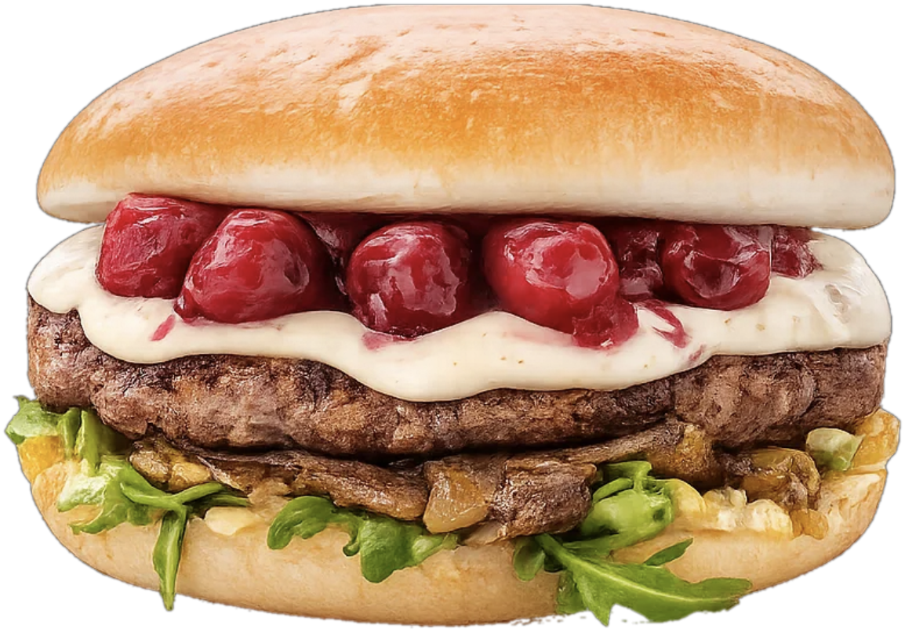
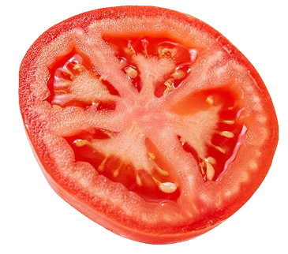
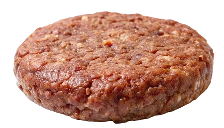

# ЕДИНЫЙ ПРОМПТ: собрать сайт TORRO BURGER

> Скопируй **весь** этот файл целиком и вставь одним сообщением в Claude Code.
> Ничего больше отправлять не нужно — здесь есть все инструкции, все ссылки на ассеты
> и весь исходный код.

---

Ты — фронтенд-разработчик. Собери с нуля статический сайт бургерной **TORRO BURGER**
и задеплой его. Работай полностью самостоятельно: не задавай уточняющих вопросов,
не предлагай варианты — просто выполни всё по шагам и в конце покажи живой URL.

## ЖЕЛЕЗНЫЕ ПРАВИЛА

1. **Файлы из раздела «ИСХОДНЫЙ КОД» создавай побайтно, ровно как написано.**
   Не сокращай, не «улучшай», не переформатируй, не заменяй куски на комментарии
   вида `/* ... остальное без изменений ... */`. Это готовый рабочий код.
2. Стек — **чистый HTML + CSS + JS**. Никаких React, Vue, Tailwind, сборщиков,
   npm-зависимостей и препроцессоров. Единственная внешняя библиотека — Lenis
   (скачивается файлом).
3. Все ассеты кладутся **локально** в папку `assets/`. На готовом сайте не должно
   остаться ни одной ссылки на сторонний CDN.
4. Дизайн, размеры и анимации не меняй по своему вкусу — числа в CSS подобраны.
5. В конце обязательно **проверь** сайт по чек-листу из раздела «ПРОВЕРКА».

## ЧТО ЭТО ЗА САЙТ

Одностраничный лендинг с внутренними страницами в стиле «плакатного» фастфуда:
кремовый фон, красный и горчичный акценты, гигантская типографика с толстой белой
обводкой, рваные края между секциями, инерционный скролл, кастомный курсор
и корзина. Порядок главной страницы:

**видео-заставка → hero «CHERRY BURGER» → меню (76 позиций с фото) → адреса → футер**

## СТРУКТУРА ПРОЕКТА

Создай папку `torro-burger` и в ней:

```
torro-burger/
├── index.html                 главная
├── menu/index.html            страница бургеров
├── contact/index.html         контакты
├── spices/index.html          ингредиенты
└── assets/
    ├── css/style.css
    ├── js/
    │   ├── lenis.min.js       скачивается
    │   ├── cart.js            корзина
    │   └── main.js            прелоадер, курсор, анимации
    ├── fonts/                 4 файла .woff2
    ├── video/loader.mp4       заставка
    └── img/
        ├── lettuce.webp tomato.webp cheese-logo.webp meat.webp
        ├── burger.webp cta.webp cherry-burger.png
        └── menu/              76 фото блюд
```

---

# ШАГ 1. АССЕТЫ

Создай папку проекта и **все последующие команды выполняй из неё** —
пути в командах относительные, из другой директории они не сработают:

```bash
mkdir -p torro-burger/assets/css torro-burger/assets/js torro-burger/assets/fonts          torro-burger/assets/video torro-burger/assets/img/menu          torro-burger/menu torro-burger/contact torro-burger/spices
cd torro-burger
pwd    # убедись, что ты внутри torro-burger
```

Если твой инструмент запуска команд не сохраняет текущую директорию между
вызовами, добавляй `cd /полный/путь/до/torro-burger && ` в начало каждой команды.

## 1.1 Шрифты (Google Fonts)

Нужны **Modak** и **Mouse Memoirs**, по два подмножества (latin + latin-ext):

```bash
curl -sS -o assets/fonts/modak-EJRYQgs1XtIEskMA-hR77LKV.woff2 \
  "https://fonts.gstatic.com/s/modak/v21/EJRYQgs1XtIEskMA-hR77LKV.woff2"
curl -sS -o assets/fonts/modak-EJRYQgs1XtIEskMO-hR77LKVTy8.woff2 \
  "https://fonts.gstatic.com/s/modak/v21/EJRYQgs1XtIEskMO-hR77LKVTy8.woff2"
curl -sS -o assets/fonts/mousememoirs-t5tmIRoSNJ-PH0WNNgDYxdSb3T7Pr7GEch8.woff2 \
  "https://fonts.gstatic.com/s/mousememoirs/v19/t5tmIRoSNJ-PH0WNNgDYxdSb3T7Pr7GEch8.woff2"
curl -sS -o assets/fonts/mousememoirs-t5tmIRoSNJ-PH0WNNgDYxdSb3TDPr7GEch8jrg.woff2 \
  "https://fonts.gstatic.com/s/mousememoirs/v19/t5tmIRoSNJ-PH0WNNgDYxdSb3TDPr7GEch8jrg.woff2"
```

Проверь, что скачались настоящие шрифты, а не страницы с ошибкой
(каждый файл должен начинаться с сигнатуры `wOF2` и весить 9–25 КБ):

```bash
for f in assets/fonts/*.woff2; do printf "%s %s %s\n" "$(head -c4 "$f")" "$(wc -c <"$f")" "$f"; done
```

Имена файлов важны — они прописаны в `style.css`. Если Google отдаст 404
(со временем меняется номер версии `v21` / `v19`), возьми актуальные ссылки так:

```bash
curl -sS -A "Mozilla/5.0" \
  "https://fonts.googleapis.com/css2?family=Modak&family=Mouse+Memoirs&display=swap"
```

В ответе перед каждым `src: url(...)` идёт комментарий с названием подмножества
(`/* latin */`, `/* latin-ext */`, `/* devanagari */`). Нужны только **latin**
и **latin-ext** для обоих шрифтов — четыре файла. Скачай их под теми же четырьмя
именами, что выше: `modak-...MA-hR77LKV.woff2` — это Modak **latin**,
`modak-...MO-hR77LKVTy8.woff2` — Modak **latin-ext**,
`mousememoirs-...T7Pr7GEch8.woff2` — Mouse Memoirs **latin**,
`mousememoirs-...TDPr7GEch8jrg.woff2` — Mouse Memoirs **latin-ext**.
Подмножество `devanagari` у Modak не нужно — не скачивай его.

## 1.2 Библиотека плавного скролла

```bash
curl -s -o assets/js/lenis.min.js "https://unpkg.com/lenis@1.1.14/dist/lenis.min.js"
```

## 1.3 Декоративные картинки (6 шт.)

Вырезанные png/webp овощей и бургеров — из открытой раздачи сайта cravburgers.shop:

```bash
for f in lettuce tomato cheese-logo meat burger cta; do
  curl -sS -o "assets/img/$f.webp" "https://www.cravburgers.shop/img-webp/$f.webp"
done
ls -la assets/img/*.webp     # должно быть 6 файлов, каждый > 5 КБ
```

Они используются в футере, в курсоре и на внутренних страницах.

## 1.4 Hero-бургер (вишнёвый, без фона)

Главная картинка сайта — вишнёвый бургер Torro «blue cherry». Исходник уже
с прозрачным фоном, нужно только обрезать поля:

```bash
python3 - <<'PY'
from PIL import Image
import urllib.request, io
url = ("https://static.tildacdn.com/stor6336-3137-4561-b337-306562343339/"
       "749ce3fcf2e056f23a2178cb29685dc4.png")
req = urllib.request.Request(url, headers={"User-Agent": "Mozilla/5.0"})
im = Image.open(io.BytesIO(urllib.request.urlopen(req, timeout=60).read())).convert("RGBA")
box = im.getchannel("A").point(lambda v: 255 if v > 50 else 0).getbbox()
im.crop(box).save("assets/img/cherry-burger.png")
print("hero:", im.crop(box).size)   # ожидается примерно 769x541
PY
```

Если `PIL` не установлен: `python3 -m pip install --user pillow`

## 1.5 Фото блюд для меню (76 шт.)

Скачиваются с сайта torroburgers.md, ужимаются и переводятся в WebP.
У 12 фото фон не вырезан — для них включается удаление фона заливкой от краёв
с последующим отбором самой крупной связной области (чтобы не осталось клякс).

```bash
python3 - <<'PY'
from PIL import Image, ImageFilter
from collections import deque
import urllib.request, io, os

MENU = {
    "blue-cherry": "https://static.tildacdn.com/stor6336-3137-4561-b337-306562343339/749ce3fcf2e056f23a2178cb29685dc4.png",
    "burger-1kg": "https://static.tildacdn.com/stor3536-3233-4635-b566-336262393435/d32956780d8489e64025f491f7bb1f56.png",
    "smash-burger": "https://static.tildacdn.com/stor6535-3136-4231-b132-653731336561/6b05e034889009450e5235e628c68592.png",
    "bro-burger": "https://static.tildacdn.com/stor3566-3561-4666-a633-636662366133/98c7d7bd93e0bfafbbad8318c0dd3d8b.png",
    "american-burger": "https://static.tildacdn.com/stor6433-3264-4166-b234-623937643733/5b6f245c39caa06ecdc65a0864b79483.png",
    "classic-cheeseburger": "https://static.tildacdn.com/stor6664-6230-4963-b233-346464386465/f23dbbee6774215f31377c17e24ef56f.png",
    "chicken-burger": "https://static.tildacdn.com/stor6339-3034-4033-a265-303733333231/c22c521a56d202c9d67f3fbc1d84a854.png",
    "crispy-chicken-burger": "https://static.tildacdn.com/stor3232-6136-4132-b263-333035353336/9ac1e848bf124850a094d7181e159f67.png",
    "mushroom-burger": "https://static.tildacdn.com/stor3738-6562-4533-b636-346632633431/885ff96ff35a353e0e76a4a7e8189244.png",
    "red-hot-chilli-burger": "https://static.tildacdn.com/stor3561-6531-4134-b131-656132623636/9cbba8d0f5736c3bc3c543c9c4938edd.png",
    "el-gran-matador-burger": "https://static.tildacdn.com/stor3435-3836-4635-b135-613135396534/a04c5508c008fd3b7e3f28a947c77dff.png",
    "blue-cheeseburger": "https://static.tildacdn.com/stor6133-3831-4165-a236-353765623633/abb8425cb50ea8e5d2eaffc352809886.png",
    "lamb-burger": "https://static.tildacdn.com/stor6330-3238-4563-a435-353263346163/ff6d49865002f99b00425c73da5ca583.png",
    "crispy-fish-burger": "https://static.tildacdn.com/stor3965-3362-4164-b064-633962346230/0e02dd899228cdebd299d0116f39a1b1.png",
    "pulled-beef": "https://static.tildacdn.com/stor6333-6363-4562-b132-376565396237/a4483bd59b47a651f440f21fc3f5decf.png",
    "torro-burger": "https://static.tildacdn.com/stor6634-6235-4261-b837-373030663261/fe12a2023c85a9a0681990b912dc24e4.png",
    "shrimp-burger": "https://static.tildacdn.com/stor6530-3832-4232-a139-323162623233/68cc2af27214ff013fd616df46b982b2.png",
    "falafel-burger": "https://static.tildacdn.com/stor6265-3134-4530-b662-346135663465/bad7409a01f8db2a9a6c8b4ff1cd706d.png",
    "hora-burger": "https://static.tildacdn.com/stor6532-3432-4932-a336-396663373839/9aa9d70e4bb9b8f2dfff411e21bf3f9e.png",
    "crispy-cheese": "https://static.tildacdn.com/stor6431-3639-4864-b037-613566396164/b636b392b05e897b88f2b4309efaa0d0.png",
    "bro-cheeseburger": "https://static.tildacdn.com/stor6330-6639-4263-b063-336464623233/1a1732ae20fb538172a7ca52ba5ac678.png",
    "bro-double-cheeseburger": "https://static.tildacdn.com/stor3966-6431-4938-b166-393661623835/64805a5e0d9c8809f46ce70c876773e5.png",
    "torro-wrap-beef": "https://static.tildacdn.com/stor3931-3065-4437-a235-346664373835/1698d9eb9ff9f4391ea0c1f10c4d8d1b.png",
    "torro-wrap-chicken": "https://static.tildacdn.com/stor3431-3331-4338-b839-616630336561/12bcd93fd56e211c6a2079938f161539.png",
    "torro-wrap-lamb": "https://static.tildacdn.com/stor3630-3865-4337-b365-363031633061/c5bd93555bfbf6e8d72bb27ace538cbc.png",
    "hot-dog": "https://static.tildacdn.com/stor6265-6331-4266-b262-656133636364/08d25d999f0234e62b384d43eccc7710.png",
    "chicken-kebab": "https://static.tildacdn.com/stor6362-3463-4238-b637-363633623030/a522ddc9e7c9696f6565214195d45758.png",
    "crispy-chicken-kebab": "https://static.tildacdn.com/stor3633-6463-4065-b331-626465656239/021a8d86e061a2513e1cbf039e56cbb5.png",
    "beef-kebab": "https://static.tildacdn.com/stor6439-3864-4162-b235-353934346234/4ea6b936bac50aa21817152fb9397ca3.png",
    "lamb-kebab": "https://static.tildacdn.com/stor6139-3732-4162-b432-626438656639/9a4d131378b81f4bb6c5f7cbd14dd9cd.png",
    "pulled-pork-kebab": "https://static.tildacdn.com/stor3039-3964-4334-a161-666564303133/9da1de6752668ee9cb88a2befe11b4cb.png",
    "crispy-fish-fillet-kebab": "https://static.tildacdn.com/stor6265-3839-4264-b833-396633633262/96391834.png",
    "blue-cheese": "https://static.tildacdn.com/stor3734-6339-4336-b437-656534663331/c2247ac462e4cd72b218eb0f16b4fbb7.png",
    "falafel-kebab": "https://static.tildacdn.com/stor3764-3965-4534-b264-313735353862/14b9874963e9584056631b92de2055f2.png",
    "corn": "https://static.tildacdn.com/stor3431-6331-4238-b661-313130323937/b0f640b0bafec4271b2cac3d801382f7.png",
    "crispy-chicken-nuggets": "https://static.tildacdn.com/stor3438-3263-4864-b137-356636386135/059630e47983821f64bfce2015564ab9.png",
    "steakhouse-fries": "https://static.tildacdn.com/stor3136-3033-4630-a165-633762353163/b20328e62a404e6b7b4c600bf14bcc3d.png",
    "potato-balls": "https://static.tildacdn.com/stor3761-3938-4565-b538-313137653066/8d6623a5c0eb0f615592485b49d9fb47.png",
    "crispy-chicken-strips": "https://static.tildacdn.com/stor6265-3932-4233-b363-386233323632/36fb8cbd73a88101c2753a2e087c5e40.png",
    "cheese-sticks": "https://static.tildacdn.com/stor3663-3135-4163-a430-363462313265/56d25f5575d4bee3c10dd2e43d47ed51.png",
    "mamaliga-balls": "https://static.tildacdn.com/stor3334-3662-4839-b766-663561363933/84f4af02babd5cb25a873e0082599313.png",
    "falafel-balls": "https://static.tildacdn.com/stor3034-6661-4464-b363-373264373134/26ef81e3567be855dcdbbc18866ff4ce.png",
    "chicken-wings-in-bbq-sauce": "https://static.tildacdn.com/stor6638-6364-4164-a364-303936613062/a2fc5d362f780ba35ca2aecf193a9fd5.png",
    "crispy-onion-rings": "https://static.tildacdn.com/stor3765-6436-4430-b537-656130353034/fd610f3292f5e296bb9c3be6f504d577.png",
    "crispy-shrimps": "https://static.tildacdn.com/stor3538-3437-4233-b063-616330343737/98d5b03773770e2ccf811817c49065b1.png",
    "crispy-chicken-4-buc": "https://static.tildacdn.com/stor3438-3263-4864-b137-356636386135/059630e47983821f64bfce2015564ab9.png",
    "crispy-chicken-6-buc": "https://static.tildacdn.com/stor3438-3263-4864-b137-356636386135/059630e47983821f64bfce2015564ab9.png",
    "crispy-chicken-8-buc": "https://static.tildacdn.com/stor3438-3263-4864-b137-356636386135/059630e47983821f64bfce2015564ab9.png",
    "grilled-sausage": "https://static.tildacdn.com/stor3030-6363-4166-a233-363338316537/23bb062f305d876892dd0340eb8e2c2e.png",
    "nuggets-box": "https://static.tildacdn.com/stor6461-3738-4161-b333-383234623636/054f2e172fac9bf552708f674021ecc9.png",
    "crispy-fish-fillet-plato": "https://static.tildacdn.com/stor6638-3065-4331-a431-396161383064/e3566f2de931825987de9b644dc95151.png",
    "pastrami-tortilla": "https://static.tildacdn.com/stor6139-3966-4466-b732-666664356136/18a23b08923ac5abb3f15547e40d7308.png",
    "chicken-torro-salad": "https://static.tildacdn.com/stor6363-3539-4930-b337-306337343234/2dbd7c981b2d6d987561018d2dba8492.png",
    "vegetarian-torro-salad": "https://static.tildacdn.com/stor3866-6362-4236-b735-333038326662/e1c1165311c6672a485c29ff4ce5f477.png",
    "shrimp-salad": "https://static.tildacdn.com/stor3133-3263-4131-b864-326133346430/37b8ca8a3025f71ed835baca7413ca2f.png",
    "chicken-crispy-salad": "https://static.tildacdn.com/stor3861-6437-4563-a133-383430373533/80618d3e0f20403bcc4ce21f6ed8e191.png",
    "crispy-fish-salad": "https://static.tildacdn.com/stor3463-3030-4233-b366-626462333931/26d7ac6f98c1620bf3fba90e759bc66c.png",
    "bulion-de-pui": "https://static.tildacdn.com/tild6336-6333-4332-a664-356333653063/IMG_2845_1.jpg",
    "chia-pudding": "https://static.tildacdn.com/tild6638-3366-4535-b339-646264313937/chia.jpg",
    "pina-colada": "https://static.tildacdn.com/stor3736-3036-4166-b261-376365616238/ad3d8e9b590cc16955a95376acb6b83a.jpg",
    "strawberry-basil": "https://static.tildacdn.com/stor6434-6161-4535-b231-333831333136/b886df978f3d74c3e37eef1d55e5d906.jpg",
    "cherry-kiwi": "https://static.tildacdn.com/stor3537-3339-4631-b163-633634343437/294a6663fbdc0d2c914535046a47c418.jpg",
    "classic-lemonade": "https://static.tildacdn.com/stor3638-3831-4230-b333-373134386434/025105daf24e830c6aacb27cf40308a5.jpg",
    "mojito": "https://static.tildacdn.com/stor3330-6539-4662-b535-326131323764/9cf3056149310285be181ab5054a46fd.jpg",
    "torro-suc": "https://static.tildacdn.com/stor6536-6565-4730-b030-663864646430/53c236bbee39a056a4e357ea98324519.png",
    "ayran": "https://static.tildacdn.com/stor3263-3237-4134-a530-306638663063/be9deaeb96288664f291d4848147feaf.png",
    "borjomi": "https://static.tildacdn.com/stor3462-3035-4531-b036-353935363036/0bac08c5bc13ed9b4524b3caca943ceb.png",
    "rich-kids-suc": "https://static.tildacdn.com/stor3665-6135-4330-a261-656630663830/3a1000ee908a3b31701e873e9c519933.png",
    "burn": "https://static.tildacdn.com/stor6535-3637-4536-a330-376532366630/1f5c0b116bd1376ddc835a5200fde7f4.png",
    "coca-cola": "https://static.tildacdn.com/stor3036-3833-4337-a363-663762336136/0474a87875ab239eadbfb4d7712279be.png",
    "fanta": "https://static.tildacdn.com/stor3564-6162-4861-b530-623465373833/45c6876bdd260c932e0a506a92455dd3.png",
    "schweppes": "https://static.tildacdn.com/stor6138-6334-4564-b266-383333396435/5a88a42ccf685aa8f0b9d1680a9b7931.png",
    "sprite": "https://static.tildacdn.com/stor6364-3166-4537-a533-383136393638/ec43e6ca2805532142c5bc2d174bd49e.png",
    "birra-moretti": "https://static.tildacdn.com/stor3237-3263-4032-b365-383732636335/9a69c42f1bd0b950ede5096675dafe7b.png",
    "torro-lager": "https://static.tildacdn.com/stor3965-6437-4163-b939-363434663439/b449526b9ba45fbe555d422d379b4670.png",
    "torro-nefiltrat": "https://static.tildacdn.com/stor3965-6437-4163-b939-363434663439/b449526b9ba45fbe555d422d379b4670.png",
}

# фото с невырезанным фоном: slug -> (допуск, сила эрозии)
CUTOUT = {
    "bulion-de-pui": (50, 0), "cherry-kiwi": (42, 0), "chicken-crispy-salad": (52, 0),
    "classic-lemonade": (16, 0), "mojito": (42, 0), "pina-colada": (16, 0),
    "strawberry-basil": (42, 0), "chia-pudding": (56, 4),
    "chicken-torro-salad": (62, 0), "crispy-fish-salad": (62, 0),
    "shrimp-salad": (62, 0), "vegetarian-torro-salad": (66, 0),
}

def fetch(url):
    req = urllib.request.Request(url, headers={"User-Agent": "Mozilla/5.0"})
    return Image.open(io.BytesIO(urllib.request.urlopen(req, timeout=60).read())).convert("RGBA")

def cut_background(im, tol, erode):
    W, H = im.size
    px = im.load()
    corners = [px[2, 2], px[W - 3, 2], px[2, H - 3], px[W - 3, H - 3]]
    bg = tuple(sum(c[i] for c in corners) // 4 for i in range(3))
    def close(p):
        return abs(p[0]-bg[0]) + abs(p[1]-bg[1]) + abs(p[2]-bg[2]) <= tol * 3
    # 1) заливка фона от всех краёв
    isbg = bytearray(W * H)
    q = deque()
    for x in range(W):
        for y in (0, H - 1):
            if close(px[x, y]) and not isbg[y*W+x]:
                isbg[y*W+x] = 1; q.append((x, y))
    for y in range(H):
        for x in (0, W - 1):
            if close(px[x, y]) and not isbg[y*W+x]:
                isbg[y*W+x] = 1; q.append((x, y))
    while q:
        x, y = q.popleft()
        for nx, ny in ((x+1, y), (x-1, y), (x, y+1), (x, y-1)):
            if 0 <= nx < W and 0 <= ny < H and not isbg[ny*W+nx] and close(px[nx, ny]):
                isbg[ny*W+nx] = 1; q.append((nx, ny))
    subj = Image.new("L", (W, H), 0)
    sp = subj.load()
    for y in range(H):
        for x in range(W):
            if not isbg[y*W+x]:
                sp[x, y] = 255
    if erode:
        subj = subj.filter(ImageFilter.MinFilter(erode*2+1))
    # 2) оставить только самую большую связную область
    spx = subj.load()
    seen = bytearray(W * H)
    best = []
    for sy in range(H):
        for sx in range(W):
            if seen[sy*W+sx] or spx[sx, sy] == 0:
                continue
            comp = []; qq = deque([(sx, sy)]); seen[sy*W+sx] = 1
            while qq:
                x, y = qq.popleft(); comp.append((x, y))
                for nx, ny in ((x+1, y), (x-1, y), (x, y+1), (x, y-1)):
                    if 0 <= nx < W and 0 <= ny < H and not seen[ny*W+nx] and spx[nx, ny] > 0:
                        seen[ny*W+nx] = 1; qq.append((nx, ny))
            if len(comp) > len(best):
                best = comp
    keep = Image.new("L", (W, H), 0)
    kp = keep.load()
    for x, y in best:
        kp[x, y] = 255
    keep = keep.filter(ImageFilter.MaxFilter(erode*2+3 if erode else 3))
    keep = keep.filter(ImageFilter.GaussianBlur(1.0 if not erode else 1.2))
    im.putalpha(keep)
    box = im.getchannel("A").getbbox()
    if box:
        x0, y0, x1, y1 = box; m = 4
        im = im.crop((max(0, x0-m), max(0, y0-m), min(W, x1+m), min(H, y1+m)))
    return im

ok = 0
for slug, url in MENU.items():
    dest = "assets/img/menu/%s.webp" % slug
    try:
        im = fetch(url)
        if slug in CUTOUT:
            im.thumbnail((500, 500), Image.LANCZOS)
            im = cut_background(im, *CUTOUT[slug])
        else:
            im.thumbnail((420, 420), Image.LANCZOS)
        im.save(dest, "WEBP", quality=82, method=6)
        ok += 1
    except Exception as e:
        print("FAIL", slug, e)
print("скачано и обработано:", ok, "из", len(MENU))
PY
```

Ожидаемый результат: 76 файлов, суммарно около 1.5 МБ.
Проверь, что нет битых: `ls assets/img/menu | wc -l` → должно быть `76`.

## 1.6 Видео-заставка

При открытии сайта на весь экран играет короткое видео (2–3 секунды), после чего
плавно растворяется и показывается сайт. Положи своё видео в
`assets/video/loader.mp4` — обязательно **H.264 MP4** (не HEVC/MOV, иначе не
воспроизведётся в Chrome и на Android).

Если исходник в `.mov`/HEVC, на macOS конвертируй так:

```bash
avconvert --preset Preset1920x1080 --source ВХОД.mov --output assets/video/loader.mp4 --replace
```

или через ffmpeg:

```bash
ffmpeg -i ВХОД.mov -c:v libx264 -pix_fmt yuv420p -an assets/video/loader.mp4
```

Если своего видео нет — ничего страшного: код заставки сам себя подстрахует,
и при отсутствующем файле сайт откроется сразу.

---

# ШАГ 2. ИСХОДНЫЙ КОД

Создай эти семь файлов **точно с таким содержимым**.

## assets/css/style.css

```css
/* CHERRY BURGER — design system */

@font-face {
  font-family: 'Modak';
  font-style: normal;
  font-weight: 400;
  font-display: swap;
  src: url('../fonts/modak-EJRYQgs1XtIEskMA-hR77LKV.woff2') format('woff2');
  unicode-range: U+0000-00FF, U+0131, U+0152-0153, U+02BB-02BC, U+02C6, U+02DA, U+02DC, U+2000-206F, U+20AC, U+2122;
}
@font-face {
  font-family: 'Modak';
  font-style: normal;
  font-weight: 400;
  font-display: swap;
  src: url('../fonts/modak-EJRYQgs1XtIEskMO-hR77LKVTy8.woff2') format('woff2');
  unicode-range: U+0100-02BA, U+02BD-02C5, U+02C7-02CC, U+1E00-1E9F, U+2020, U+20A0-20AB, U+20AD-20C0;
}
@font-face {
  font-family: 'Mouse Memoirs';
  font-style: normal;
  font-weight: 400;
  font-display: swap;
  src: url('../fonts/mousememoirs-t5tmIRoSNJ-PH0WNNgDYxdSb3T7Pr7GEch8.woff2') format('woff2');
  unicode-range: U+0000-00FF, U+0131, U+0152-0153, U+02BB-02BC, U+02C6, U+02DA, U+02DC, U+2000-206F, U+20AC, U+2122;
}
@font-face {
  font-family: 'Mouse Memoirs';
  font-style: normal;
  font-weight: 400;
  font-display: swap;
  src: url('../fonts/mousememoirs-t5tmIRoSNJ-PH0WNNgDYxdSb3TDPr7GEch8jrg.woff2') format('woff2');
  unicode-range: U+0100-02BA, U+02BD-02C5, U+02C7-02CC, U+1E00-1E9F, U+2020, U+20A0-20AB, U+20AD-20C0;
}

:root {
  --beige: #f5e3cd;
  --black: #1b1b1b;
  --red: #f91814;
  --mustard: #ffd750;
  --mustard-dark: #f4a804;
  --maroon: #4c0016;
  --green: #60a905;
  --brown: #662c00;
  --white: #fff;
  --font-modak: 'Modak', system-ui, sans-serif;
  --font-mouse: 'Mouse Memoirs', system-ui, sans-serif;
}

* { box-sizing: border-box; margin: 0; padding: 0; }
html { height: 100%; }
html.lenis, html.lenis body { height: auto; }
.lenis.lenis-smooth { scroll-behavior: auto !important; }

body {
  background: var(--beige);
  color: var(--black);
  font-family: var(--font-mouse);
  overflow-x: clip;
  min-height: 100%;
  -webkit-font-smoothing: antialiased;
}

img { max-width: 100%; display: block; }
a { color: inherit; text-decoration: none; }
button { font: inherit; background: none; border: none; cursor: pointer; color: inherit; }

.sr-only {
  position: absolute; width: 1px; height: 1px; padding: 0; margin: -1px;
  overflow: hidden; clip: rect(0,0,0,0); white-space: nowrap; border: 0;
}

/* ---------- type utilities ---------- */
.f-modak { font-family: var(--font-modak); }
.f-mouse { font-family: var(--font-mouse); }
.stroke-big   { -webkit-text-stroke: 2.5vw var(--white); paint-order: stroke fill; }
.stroke-180   { -webkit-text-stroke: 1vw var(--white); paint-order: stroke fill; }
.stroke-small { -webkit-text-stroke: 5px var(--white); paint-order: stroke fill; }
.stroke-thin  { -webkit-text-stroke: .35vw var(--white); paint-order: stroke fill; }
.text40 { font-size: 1.8vw; }
.text60 { font-size: 2.8vw; }
.heading300 { font-size: 15vw; font-family: var(--font-mouse); }
.upper { text-transform: uppercase; }

@media (max-width: 768px) {
  .text40 { font-size: 5vw; }
  .text60 { font-size: 6.5vw; }
  .heading300 { font-size: 24vw; }
}

/* ---------- word reveal animation ---------- */
.reveal .w {
  display: inline-block;
  transform: translateY(120%) rotate(6deg);
  opacity: 0;
  will-change: transform;
  transition: transform .9s cubic-bezier(.22,1,.36,1), opacity .6s ease;
}
.reveal.in .w { transform: translateY(0) rotate(0); opacity: 1; }
.reveal .wc { display: inline-block; overflow: clip; vertical-align: bottom; padding: 0 .06em; margin: 0 -.06em; }

.fade-up {
  opacity: 0; transform: translateY(4vw);
  transition: opacity .8s ease, transform .9s cubic-bezier(.22,1,.36,1);
}
.fade-up.in { opacity: 1; transform: none; }

/* ---------- video preloader ---------- */
#preloader {
  position: fixed; inset: 0; z-index: 10000;
  background: #000;
  display: flex; align-items: center; justify-content: center;
  transition: opacity .9s ease;
}
#preloader video {
  width: 100%; height: 100%; object-fit: cover;
}
#preloader.done { opacity: 0; pointer-events: none; }
#preloader .skip {
  position: absolute; bottom: 3vh; right: 3vw; z-index: 2;
  color: #fff; opacity: 0; font-family: var(--font-mouse);
  letter-spacing: .15em; text-transform: uppercase; font-size: 14px;
}

/* ---------- page transition curtain ---------- */
#curtain {
  position: fixed; inset: 0; z-index: 9999;
  pointer-events: none;
  display: flex; align-items: center; justify-content: center;
  background: var(--red);
  transform: translateY(101%);
}
#curtain.wipe-in { transition: transform .55s cubic-bezier(.65,0,.35,1); transform: translateY(0); }
#curtain.wipe-out { transition: transform .55s cubic-bezier(.65,0,.35,1); transform: translateY(-101%); }
#curtain span {
  font-family: var(--font-modak);
  color: var(--maroon);
  font-size: 9vw; text-transform: uppercase;
}

/* ---------- custom cursor: flying ingredients ---------- */
@media (hover:hover) and (pointer:fine) {
  .cursor-ing {
    position: fixed; top: 0; left: 0; z-index: 9998;
    width: 2.2vw; min-width: 28px; max-width: 44px;
    pointer-events: none; opacity: 0;
    transition: opacity .35s ease;
    will-change: transform;
    filter: drop-shadow(0 4px 8px rgba(27,27,27,.3));
  }
  body.cursor-on .cursor-ing { opacity: 1; }
}
@media (max-width: 768px), (hover:none) { .cursor-ing { display: none; } }

/* ---------- cart system ---------- */
.cart-chip {
  position: fixed; right: 2.5vw; bottom: 2.5vw; z-index: 500;
  background: var(--red); color: var(--beige);
  border-radius: 99px; padding: 1vw 2vw;
  font-family: var(--font-mouse); text-transform: uppercase; font-size: 1.4vw;
  box-shadow: 0 .5vw 1.5vw rgba(27,27,27,.25);
  display: flex; gap: 1vw; align-items: center;
  transition: transform .3s cubic-bezier(.34,1.56,.64,1);
}
.cart-chip:hover { transform: scale(1.05); }
.cart-chip .n {
  background: var(--mustard); color: var(--black);
  font-family: var(--font-modak);
  border-radius: 50%; width: 2.2vw; height: 2.2vw; min-width: 26px; min-height: 26px;
  display: flex; align-items: center; justify-content: center; font-size: 1.2vw;
}
.cart-chip.bump .n { animation: bump .4s cubic-bezier(.34,1.56,.64,1); }
@keyframes bump { 0%{transform:scale(1)} 40%{transform:scale(1.5)} 100%{transform:scale(1)} }
.cart-panel {
  position: fixed; right: 2.5vw; bottom: 7.5vw; z-index: 500;
  width: 26vw; min-width: 320px; max-height: 60vh; overflow-y: auto;
  background: var(--white); border-radius: 1.2vw; padding: 1.6vw;
  box-shadow: 0 1vw 3vw rgba(27,27,27,.25);
  opacity: 0; transform: translateY(1vw) scale(.97); pointer-events: none;
  transition: opacity .3s ease, transform .3s ease;
}
.cart-panel.open { opacity: 1; transform: none; pointer-events: auto; }
.cart-panel h4 { font-family: var(--font-mouse); font-weight: 400; text-transform: uppercase; font-size: 1.6vw; margin-bottom: 1vw; }
.cart-panel .line { display: flex; align-items: center; justify-content: space-between; gap: 1vw; font-size: 1.3vw; text-transform: uppercase; padding: .5vw 0; }
.cart-panel .line .nm2 { flex: 1; line-height: 1.05; }
.cart-panel .qty { display: flex; gap: .5vw; align-items: center; flex-shrink: 0; }
.cart-panel .qb {
  width: 1.6vw; height: 1.6vw; min-width: 22px; min-height: 22px;
  border-radius: 50%; background: var(--beige);
  font-family: var(--font-mouse); font-size: 1.1vw; line-height: 1;
  display: flex; align-items: center; justify-content: center;
  transition: background .2s ease, transform .2s ease;
}
.cart-panel .qb:hover { background: var(--mustard); transform: scale(1.1); }
.cart-panel .sum { font-family: var(--font-modak); color: var(--red); white-space: nowrap; }
.cart-panel .tot { border-top: 2px solid rgba(27,27,27,.15); margin-top: 1vw; padding-top: 1vw; display: flex; justify-content: space-between; font-size: 1.5vw; text-transform: uppercase; }
.cart-panel .empty { font-size: 1.3vw; opacity: .6; text-transform: uppercase; }
.cart-panel .co {
  margin-top: 1.2vw; width: 100%; text-align: center;
  background: var(--red); color: var(--beige);
  border-radius: 99px; padding: .9vw;
  font-family: var(--font-mouse); text-transform: uppercase; font-size: 1.4vw;
  transition: transform .25s ease;
}
.cart-panel .co:hover { transform: scale(1.03); }
.cart-panel .clear {
  margin-top: .6vw; width: 100%; text-align: center;
  font-family: var(--font-mouse); text-transform: uppercase; font-size: 1vw;
  opacity: .5; transition: opacity .2s ease;
}
.cart-panel .clear:hover { opacity: 1; }
.cart-panel .phones { margin-top: 1vw; }
.cart-panel .phones a {
  display: block; text-align: center; margin-top: .6vw;
  font-family: var(--font-mouse); font-size: 1.4vw; text-transform: uppercase;
  background: var(--mustard); border-radius: 99px; padding: .7vw;
  transition: transform .25s ease, background .25s ease;
}
.cart-panel .phones a:hover { transform: scale(1.04); background: var(--mustard-dark); }
.cart-panel .phones .loc { font-size: 1vw; opacity: .6; margin-top: .8vw; text-align: center; text-transform: uppercase; }
.menu-item .addb {
  flex-shrink: 0;
  width: 2.2vw; height: 2.2vw; min-width: 28px; min-height: 28px;
  border-radius: 50%; background: var(--mustard); color: var(--black);
  font-family: var(--font-mouse); font-size: 1.5vw; line-height: 1;
  display: flex; align-items: center; justify-content: center;
  transition: transform .25s ease, background .25s ease;
}
.menu-item .addb:hover { transform: scale(1.15) rotate(90deg); background: var(--white); }
.card-b .add {
  font-family: var(--font-mouse); text-transform: uppercase; font-size: 1.2vw;
  background: var(--red); color: var(--beige);
  padding: .6vw 1.6vw; border-radius: 99px;
  transition: transform .25s ease, background .25s ease;
}
.card-b .add:hover { transform: scale(1.06); }
.card-b .add.done { background: var(--green); }
@media (max-width:768px){
  .cart-chip { right: 4vw; bottom: 4vw; padding: 3vw 6vw; font-size: 4.4vw; gap: 3vw; }
  .cart-chip .n { width: 7vw; height: 7vw; font-size: 4vw; }
  .cart-panel { right: 4vw; bottom: 20vw; width: 92vw; border-radius: 4vw; padding: 5vw; max-height: 62vh; }
  .cart-panel h4 { font-size: 5.5vw; margin-bottom: 3vw; }
  .cart-panel .line { font-size: 4.2vw; padding: 1.6vw 0; }
  .cart-panel .qb { width: 6.5vw; height: 6.5vw; font-size: 4vw; }
  .cart-panel .tot { font-size: 4.8vw; margin-top: 3vw; padding-top: 3vw; }
  .cart-panel .empty { font-size: 4.2vw; }
  .cart-panel .co { font-size: 4.6vw; padding: 3vw; margin-top: 4vw; }
  .cart-panel .clear { font-size: 3.4vw; margin-top: 2vw; }
  .cart-panel .phones a { font-size: 4.4vw; padding: 2.6vw; margin-top: 2vw; }
  .cart-panel .phones .loc { font-size: 3.2vw; }
  .menu-item .addb { width: 8vw; height: 8vw; font-size: 4.6vw; }
  .card-b .add { font-size: 4vw; padding: 2vw 5vw; }
}

/* ---------- nav ---------- */
.nav {
  position: fixed; top: 0; left: 0; width: 100%; z-index: 999;
  display: flex; align-items: center; justify-content: space-between;
  padding: 1vw 2.5vw;
}
.nav .logo {
  font-family: var(--font-modak);
  color: var(--red);
  -webkit-text-stroke: 5px var(--white); paint-order: stroke fill;
  font-size: 4vw; line-height: 1.1;
  transition: transform .3s ease;
  display: inline-block;
}
.nav .logo:hover { transform: scale(1.05); }
.nav .right { display: flex; align-items: center; gap: 1vw; }
.nav .pill {
  font-family: var(--font-mouse); text-transform: uppercase;
  font-size: 1.3vw; letter-spacing: .025em;
  display: flex; align-items: center; justify-content: center;
  padding: .8vw 2vw; border-radius: 10vw;
  background: var(--red); color: var(--beige);
  transition: transform .3s ease;
}
.nav .pill:hover { transform: scale(1.05); }
.nav .menu-wrap { position: relative; }
.nav .menu-btn {
  display: flex; align-items: center; gap: .6vw;
  padding: .8vw 1.4vw; border-radius: 10vw;
  border: 1.5px solid rgba(27,27,27,.35);
  background: rgba(245,227,205,.6); backdrop-filter: blur(8px);
  font-family: var(--font-mouse); text-transform: uppercase;
  font-size: 1.3vw; letter-spacing: .025em;
  transition: transform .3s ease;
}
.nav .menu-btn:hover { transform: scale(1.05); }
.nav .burger-icon { position: relative; width: 1.2vw; height: 1.2vw; flex-shrink: 0; }
.nav .burger-icon span {
  position: absolute; left: 0; display: block; height: .15vw; min-height: 2px;
  background: var(--black); border-radius: 99px; transition: all .3s ease;
}
.nav .burger-icon span:nth-child(1) { top: 0; width: 100%; }
.nav .burger-icon span:nth-child(2) { top: 50%; width: 70%; transform: translateY(-50%); }
.nav .burger-icon span:nth-child(3) { bottom: 0; width: 100%; }
.nav .dropdown {
  position: absolute; top: calc(100% + 1vw); right: 0;
  width: 18vw; background: var(--red);
  border-radius: 1.2vw; padding: 1.5vw;
  opacity: 0; transform: translateY(-1vw) scale(.96); transform-origin: top right;
  pointer-events: none;
  transition: opacity .3s ease, transform .3s ease;
}
.nav .menu-wrap.open .dropdown { opacity: 1; transform: none; pointer-events: auto; }
.nav .dropdown a {
  display: block;
  font-family: var(--font-modak); font-size: 2.4vw; line-height: 1.15;
  text-transform: uppercase; color: var(--beige);
  transition: color .25s ease, transform .25s ease;
}
.nav .dropdown a:hover { color: var(--mustard); transform: scale(1.03); }
.nav .dropdown .est {
  margin-top: 1.5vw; padding-top: 1vw;
  border-top: 1px solid rgba(245,227,205,.2);
  font-family: var(--font-mouse); font-size: .9vw;
  text-transform: uppercase; letter-spacing: .2em; color: rgba(245,227,205,.85);
}

/* link roll-over (two stacked labels) */
.roll { display: inline-block; position: relative; overflow: clip; vertical-align: bottom; }
.roll b { display: block; font-weight: inherit; transition: transform .3s ease; }
.roll i { position: absolute; inset: 0; font-style: normal; transform: translateY(100%); transition: transform .3s ease; }
a:hover .roll b, button:hover .roll b { transform: translateY(-100%); }
a:hover .roll i, button:hover .roll i { transform: translateY(0); }

/* ---------- hero ---------- */
.hero {
  height: 100svh; width: 100%; position: relative;
  display: flex; flex-direction: column; justify-content: space-between; align-items: center;
  padding-top: 8vw;
}
.hero-title-wrap { position: relative; width: fit-content; height: fit-content; }
.hero-title {
  font-size: 30vw; line-height: .8; text-align: center;
  color: var(--red); font-family: var(--font-mouse); font-weight: 400;
  -webkit-text-stroke: 1vw var(--white); paint-order: stroke fill;
  white-space: nowrap;
}
.hero .sticker-note {
  position: absolute; z-index: 10;
  color: var(--mustard-dark);
  -webkit-text-stroke: 1vw var(--white); paint-order: stroke fill;
  font-family: var(--font-modak); font-size: 2.8vw; line-height: 1;
  text-align: center; text-transform: uppercase;
}
.hero .note-tl { top: 17%; left: 13vw; rotate: 15deg; }
.hero .note-br { top: 46%; right: 10vw; rotate: -15deg; }
.hero-burger {
  width: 40vw; height: 40vw; z-index: 20;
  position: absolute; top: 60%; left: 50%;
  translate: -50% -60%;
}
.hero-burger img {
  width: 100%; height: 100%; object-fit: contain;
  filter: drop-shadow(0 2vw 3vw rgba(27,27,27,.35));
}
.hero-sub {
  font-family: var(--font-modak);
  font-size: 15vw; line-height: 1; text-transform: uppercase;
  color: var(--mustard-dark);
  -webkit-text-stroke: 1vw var(--white); paint-order: stroke fill;
  position: relative; z-index: 20;
  translate: 0 -6vw;
  text-align: center;
}
.hero-bottom {
  position: absolute; bottom: 0; left: 0; width: 100%;
  display: flex; justify-content: flex-end;
  padding: 2vw 2.5vw;
}
.hero-ing {
  width: 23vw; text-align: right; line-height: 1;
  font-size: 1.8vw;
}
.hero-ing span { display: block; }

@media (max-width: 768px) {
  .hero { height: auto; min-height: 100svh; padding-top: 40vw; padding-bottom: 2vw; }
  .hero-title { font-size: 26vw; line-height: .85; }
  .hero .sticker-note { font-size: 6vw; }
  .hero .note-tl { top: 26vw; left: 4vw; rotate: 0deg; }
  .hero .note-br { top: 155vw; right: 5vw; rotate: 0deg; z-index: 30; }
  .hero-burger { width: 80vw; height: 80vw; position: absolute; top: 110vw; translate: -50% -50%; }
  .hero-sub { font-size: 20vw; translate: 0 0; margin-top: 46vw; }
  .hero-bottom { position: static; flex-direction: column; align-items: center; gap: 4vw; padding: 5vw; }
  .hero-ing { width: 100%; text-align: center; font-size: 5vw; }
}

/* ---------- torn edge divider ---------- */
.tear { position: absolute; left: 0; right: 0; z-index: 99; overflow-x: clip; pointer-events: none; line-height: 0; }
.tear svg { width: 100%; height: 3.5vw; display: block; }
.tear-top { top: -1px; }
.tear-bottom { bottom: -1px; transform: scaleY(-1); }

/* ---------- generic section headers ---------- */
.kicker {
  color: var(--red);
  -webkit-text-stroke: 1vw var(--white); paint-order: stroke fill;
  font-family: var(--font-modak); font-size: 2.8vw; line-height: 1;
  text-transform: uppercase; text-align: center;
  display: inline-block;
}
@media (max-width:768px){ .kicker { font-size: 7vw; } }

/* ---------- menu section (Torro) ---------- */
.menu-sec {
  position: relative; width: 100%;
  background: var(--red);
  padding: 10vw 0 8vw;
  z-index: 5;
}
.menu-sec .menu-head { text-align: center; position: relative; z-index: 2; }
.menu-sec .menu-kicker {
  color: var(--mustard-dark);
  -webkit-text-stroke: 1vw var(--white); paint-order: stroke fill;
  font-family: var(--font-modak); font-size: 2.8vw;
  text-transform: uppercase; display: inline-block; rotate: -5deg;
}
.menu-sec h2 {
  font-family: var(--font-mouse); font-weight: 400;
  font-size: 15vw; line-height: .8; text-transform: uppercase;
  color: var(--beige);
  -webkit-text-stroke: 1vw rgba(244,168,4,.3); paint-order: stroke fill;
}
.menu-sec .menu-note { color: var(--beige); font-size: 1.8vw; margin-top: 1.5vw; opacity: .9; }
.menu-cats {
  width: min(76vw, 1200px); margin: 5vw auto 0;
  display: flex; flex-direction: column; gap: 4.5vw;
}
.menu-cat h3 {
  font-family: var(--font-modak); font-size: 4.5vw; line-height: 1.1;
  color: var(--mustard);
  -webkit-text-stroke: .5vw var(--white); paint-order: stroke fill;
  text-transform: uppercase;
  margin-bottom: 1.6vw;
  rotate: -2deg; transform-origin: left bottom;
}
.menu-item {
  display: flex; align-items: center; gap: 1vw;
  padding: .55vw 0;
  color: var(--beige);
  font-size: 2vw; line-height: 1; text-transform: uppercase;
}
.menu-item .ph {
  width: 10vw; height: 10vw; object-fit: contain; flex-shrink: 0;
  filter: drop-shadow(0 .4vw .6vw rgba(0,0,0,.3));
  transition: transform .35s cubic-bezier(.34,1.56,.64,1);
}
.menu-item:hover .ph { transform: scale(1.22) rotate(-4deg); }
.menu-item .nm { white-space: nowrap; }
.menu-item .gr { font-size: 1.2vw; opacity: .65; white-space: nowrap; }
.menu-item .dots {
  flex: 1; min-width: 2vw;
  border-bottom: .18vw dotted rgba(245,227,205,.4);
  translate: 0 -.35vw;
}
.menu-item .pr {
  font-family: var(--font-modak);
  color: var(--mustard);
  font-size: 2.2vw; white-space: nowrap;
}
.menu-item .badge {
  font-size: 1vw; letter-spacing: .12em;
  background: var(--mustard); color: var(--black);
  padding: .25vw .8vw; border-radius: 99px;
  translate: 0 -.3vw;
}
/* staggered scroll-in */
.menu-item { opacity: 0; transform: translateY(2.5vw); transition: opacity .6s ease, transform .7s cubic-bezier(.22,1,.36,1); }
.menu-item.in { opacity: 1; transform: none; }
.menu-cat h3 { opacity: 0; transform: translateY(2.5vw) rotate(-2deg); transition: opacity .6s ease, transform .7s cubic-bezier(.22,1,.36,1); }
.menu-cat.in h3 { opacity: 1; transform: rotate(-2deg) translateY(0); }

@media (max-width: 768px) {
  .menu-sec { padding: 16vw 0 14vw; }
  .menu-sec .menu-kicker { font-size: 7vw; }
  .menu-sec h2 { font-size: 22vw; line-height: .85; }
  .menu-sec .menu-note { font-size: 4.2vw; padding: 0 6vw; }
  .menu-cats { width: 88vw; gap: 12vw; }
  .menu-cat h3 { font-size: 11vw; -webkit-text-stroke: 1.2vw var(--white); margin-bottom: 5vw; }
  .menu-item { font-size: 4.6vw; padding: 1.6vw 0; gap: 2vw; }
  .menu-item .ph { width: 24vw; height: 24vw; }
  .menu-item .nm { white-space: normal; line-height: 1.05; }
  .menu-item .gr { font-size: 3vw; }
  .menu-item .pr { font-size: 5vw; }
  .menu-item .badge { font-size: 2.6vw; padding: .8vw 2.4vw; }
  .menu-item .dots { border-bottom-width: .5vw; }
}

/* ---------- about ---------- */
.about {
  position: relative; z-index: 100; width: 100%;
  text-align: center; padding: 6vw 0;
  display: flex; flex-direction: column; gap: 2vw;
  overflow: clip;
}
.about .head { position: relative; display: flex; flex-direction: column; gap: 1vw; }
.about .kicker { rotate: -5deg; position: relative; top: -1vw; }
.about h2 {
  font-size: 15vw; font-family: var(--font-mouse); font-weight: 400;
  line-height: .75; text-transform: uppercase;
  color: var(--red);
  -webkit-text-stroke: 1vw var(--white); paint-order: stroke fill;
  width: 70%; margin: 0 auto;
}
.about .lede { width: 45%; margin: 2vw auto 0; font-size: 1.8vw; line-height: 1.1; }
.about-gallery {
  display: grid; grid-template-columns: repeat(3, auto); gap: 1vw;
  justify-content: center; margin: 2vw auto 0; padding: 0 10vw 2vw;
  position: relative;
}
.about-gallery .ph {
  height: 25vw; width: 20vw; border-radius: 1vw; overflow: hidden;
}
.about-gallery .ph img { width: 100%; height: 100%; object-fit: cover; transition: transform .6s ease; }
.about-gallery .ph:hover img { transform: scale(1.06); }
.about .selfie-sticker {
  position: absolute; width: 15vw; top: -12vw; left: 5vw; z-index: 50;
  rotate: -8deg;
  filter: drop-shadow(0 9px 12px rgba(0,0,0,.25));
}
@media (max-width:768px){
  .about { padding: 12vw 0; gap: 6vw; }
  .about h2 { width: 96%; font-size: 24vw; }
  .about .lede { width: 90%; font-size: 5vw; }
  .about-gallery { display: flex; align-items: flex-end; padding: 0 4vw 8vw; gap: 2vw; }
  .about-gallery .ph { width: 35vw; height: 44vw; flex-shrink: 0; border-radius: 2.5vw; }
  .about-gallery .ph:nth-child(4) { display: none; }
  .about .selfie-sticker { width: 25vw; top: -26vw; left: -4vw; }
}

/* big cta button (mustard blob) */
.btn-blob {
  position: relative; display: block; width: fit-content; margin: 0 auto;
  user-select: none;
}
.btn-blob .bg {
  position: absolute; inset: -8% -4%;
  background: var(--mustard-dark);
  border-radius: 48% 52% 55% 45% / 55% 48% 52% 45%;
  transition: transform .35s cubic-bezier(.34,1.56,.64,1), background .3s ease;
  box-shadow: 0 .6vw 0 rgba(76,0,22,.25);
}
.btn-blob:hover .bg { transform: scale(1.06) rotate(-2deg); background: var(--mustard); }
.btn-blob .lb {
  position: relative; z-index: 10; display: inline-block;
  color: var(--white); text-transform: uppercase; font-weight: 700;
  font-size: 1.8vw; padding: 1.5vw 4vw;
  -webkit-text-stroke: 0;
}
@media (max-width:768px){ .btn-blob .lb { font-size: 5vw; padding: 4vw 10vw; } }

/* ---------- experience (red) ---------- */
.exp {
  position: relative; width: 100%; background: var(--red);
  margin-top: 0; padding-bottom: 0; z-index: 4;
  display: flex; flex-direction: column; align-items: center;
  overflow: clip;
}
.exp-inner { position: relative; width: 100%; display: flex; flex-direction: column; align-items: center; padding-top: 6vw; }
.exp .kicker { color: var(--red); rotate: -8deg; position: absolute; top: 5vw; left: 50%; translate: -50% 0; z-index: 30; }
.exp h2 {
  text-align: center; font-size: 15vw; line-height: .75;
  font-family: var(--font-mouse); font-weight: 400; text-transform: uppercase;
  color: var(--beige); position: relative; z-index: 20;
  margin-top: 8vw; width: 100%;
}
.exp .fries-sticker { position: absolute; width: 14vw; top: 5vw; left: 5vw; z-index: 50; rotate: -6deg; filter: drop-shadow(0 9px 12px rgba(0,0,0,.3)); }
.exp .burger-sticker { position: absolute; width: 18vw; top: 20vw; right: 2vw; z-index: 50; rotate: 8deg; filter: drop-shadow(0 9px 12px rgba(0,0,0,.3)); }
.exp-hands { display: flex; align-items: flex-end; justify-content: space-between; width: 100%; position: relative; }
.exp-hands .col { color: var(--beige); font-size: 1.8vw; line-height: 1.1; text-transform: uppercase; z-index: 20; padding: 0 0 2vw 2vw; white-space: nowrap; }
.exp-hands .col.right { text-align: right; padding: 0 2vw 2vw 0; }
.exp-hands .center { width: 80vw; position: relative; z-index: 10; translate: 0 .5vw; }
.exp-hands .center > img { width: 100%; height: auto; object-fit: contain; position: relative; z-index: 10; }
.exp-hands .bold-note {
  position: absolute; z-index: 20;
  color: var(--mustard-dark);
  -webkit-text-stroke: 1vw var(--white); paint-order: stroke fill;
  font-family: var(--font-modak); font-size: 2.8vw; line-height: 1;
  width: 10vw; text-align: center; text-transform: uppercase;
  bottom: 10vw; right: 4vw; rotate: 15deg;
}
@media (max-width:768px){
  .exp .kicker { font-size: 7vw; }
  .exp h2 { font-size: 14vw; margin-top: 15vw; }
  .exp .fries-sticker { width: 25vw; top: 30vw; left: -4vw; }
  .exp .burger-sticker { width: 35vw; top: 35vw; right: -6vw; }
  .exp-hands { flex-direction: column; align-items: center; margin-top: 15vw; position: relative; }
  .exp-hands .center { width: 100vw; }
  .exp-hands .col { position: absolute; bottom: -2vw; left: 0; font-size: 6vw; padding: 0 0 0 3vw; }
  .exp-hands .col.right { left: auto; right: 0; padding: 0 3vw 0 0; }
  .exp-hands .bold-note { font-size: 6.5vw; width: 22vw; bottom: 24vw; right: 2vw; }
}

/* cheesy parallax band */
.cheesy {
  position: relative; height: 160vh; width: 100%; overflow: clip; z-index: 3;
}
.cheesy img { width: 100%; height: 120%; object-fit: cover; position: relative; top: -10%; will-change: transform; }
@media (max-width:768px){ .cheesy { height: 70vh; } }

/* ---------- take away (mustard) ---------- */
.away {
  position: relative; width: 100%; background: var(--mustard);
  overflow: hidden; z-index: 4;
}
.away .inner { position: relative; height: 163vw; width: 100%; }
.away .plane { position: absolute; top: 4vw; left: 2vw; width: 15vw; pointer-events: none; z-index: 5; }
.away .head { position: relative; z-index: 10; padding-top: 14vw; margin-left: 6vw; }
.away .kicker { color: var(--mustard-dark); rotate: -7deg; margin-left: 1vw; display: inline-block; }
.away h2 {
  color: var(--white);
  -webkit-text-stroke: 1vw rgba(244,168,4,.3); paint-order: stroke fill;
  font-size: 15vw; line-height: .85; font-family: var(--font-mouse); font-weight: 400;
  width: 80vw; text-transform: uppercase; margin-top: 1vw;
}
.away .lede { font-size: 1.8vw; width: 30vw; margin: 2vw 0 0 1vw; line-height: 1.1; }
.away .stop { position: absolute; display: flex; flex-direction: column; gap: 1.5vw; z-index: 20; }
.away .stop .city {
  color: var(--red); text-transform: uppercase;
  font-family: var(--font-modak); font-size: 1.8vw; line-height: .9;
  -webkit-text-stroke: 5px var(--white); paint-order: stroke fill;
}
.away .stop .ph { width: 14vw; height: 17vw; border-radius: 1vw; overflow: hidden; }
.away .stop .ph img { width: 100%; height: 100%; object-fit: cover; }
.away .s1 { right: 5vw; top: 50vw; align-items: flex-end; }
.away .s1 .city { rotate: 7deg; text-align: right; }
.away .s2 { left: 35vw; top: 64vw; align-items: flex-start; }
.away .s2 .city { rotate: -7deg; }
.away .s3 { right: 20vw; top: 80vw; align-items: flex-end; }
.away .s3 .city { rotate: 12deg; text-align: right; }
.away .s4 { left: 15vw; top: 105vw; align-items: flex-start; }
.away .s4 .city { rotate: -12deg; }
.away .s5 { right: 14vw; top: 130vw; align-items: flex-end; }
.away .s5 .city { rotate: 6deg; text-align: right; }
.away .route { position: absolute; inset: 0; z-index: 1; width: 100%; height: 100%; }
.away .route path { fill: none; stroke: rgba(102,44,0,.5); stroke-width: .35vw; stroke-dasharray: 1.2vw 1.6vw; stroke-linecap: round; }

/* mobile take-away */
.away-m { display: none; }
@media (max-width:768px){
  .away { display: none; }
  .away-m {
    display: block; position: relative; background: var(--mustard);
    padding: 18vw 0 14vw; z-index: 4; overflow: clip;
  }
  .away-m .kicker { color: var(--mustard-dark); font-size: 7vw; margin-left: 5vw; }
  .away-m h2 {
    color: var(--white); -webkit-text-stroke: 1.4vw rgba(244,168,4,.3); paint-order: stroke fill;
    font-size: 17vw; line-height: .85; font-family: var(--font-mouse); font-weight: 400;
    text-transform: uppercase; margin: 2vw 5vw 0;
  }
  .away-m .lede { font-size: 5vw; margin: 5vw; line-height: 1.15; }
  .away-m .strip { display: flex; gap: 4vw; overflow-x: auto; padding: 6vw 5vw; -webkit-overflow-scrolling: touch; scrollbar-width: none; }
  .away-m .strip::-webkit-scrollbar { display: none; }
  .away-m .stop { flex-shrink: 0; display: flex; flex-direction: column; gap: 2vw; }
  .away-m .city {
    color: var(--red); text-transform: uppercase;
    font-family: var(--font-modak); font-size: 6vw; line-height: 1;
    -webkit-text-stroke: 4px var(--white); paint-order: stroke fill;
  }
  .away-m .ph { width: 56vw; height: 66vw; border-radius: 3vw; overflow: hidden; }
  .away-m .ph img { width: 100%; height: 100%; object-fit: cover; }
}

/* ---------- cta ---------- */
.cta {
  position: relative; width: 100%; background: var(--beige);
  padding-top: 14vw; overflow: clip;
}
.cta .wrap {
  min-height: 100svh; margin: 0 0 8vw; position: relative;
  display: flex; align-items: center; justify-content: center; gap: 3vw;
  padding: 0 4vw;
}
.cta .txt { width: 55vw; display: flex; flex-direction: column; gap: 2vw; align-items: flex-start; }
.cta .kicker { rotate: -7deg; margin-left: .5vw; font-size: 2.8vw; }
.cta h2 {
  color: var(--red);
  -webkit-text-stroke: 1vw var(--white); paint-order: stroke fill;
  font-size: 15vw; line-height: .78; font-family: var(--font-mouse); font-weight: 400;
  text-transform: uppercase;
}
.cta .lede { font-size: 1.8vw; width: 30vw; line-height: 1.1; }
.cta .btn-blob { margin: 1vw 0 0; }
.cta .photo { width: 42vw; height: 56vw; border-radius: 2vw; overflow: hidden; flex-shrink: 0; }
.cta .photo img { width: 100%; height: 100%; object-fit: cover; }
.cta .boy-sticker {
  position: absolute; z-index: 22; width: 13vw;
  bottom: 1vw; left: 42%; rotate: -45deg;
  filter: drop-shadow(0 9px 12px rgba(0,0,0,.25));
}
@media (max-width:768px){
  .cta { padding-top: 12vw; }
  .cta .wrap { flex-direction: column; margin: 0 0 2vw; gap: 6vw; min-height: 0; }
  .cta .txt { width: 100%; align-items: center; gap: 4vw; }
  .cta .kicker { font-size: 7vw; rotate: 0deg; }
  .cta h2 { font-size: 20vw; line-height: .85; text-align: center; }
  .cta .lede { width: 92%; font-size: 4.2vw; text-align: center; }
  .cta .photo { width: 100%; height: 50vh; border-radius: 4vw; }
  .cta .boy-sticker { width: 30vw; bottom: 62vw; left: 2vw; }
}

/* ---------- locations (Torro) ---------- */
.locs {
  position: relative; background: var(--beige);
  padding: 6vw 2.5vw 2vw; z-index: 10;
}
.locs .head { text-align: center; margin-bottom: 3.5vw; }
.locs .kicker { rotate: -4deg; }
.locs h2 {
  font-family: var(--font-mouse); font-weight: 400; text-transform: uppercase;
  font-size: 8vw; line-height: .9; color: var(--red);
  -webkit-text-stroke: .8vw var(--white); paint-order: stroke fill;
}
.locs .grid {
  display: grid; grid-template-columns: repeat(3, 1fr); gap: 2vw;
  width: min(86vw, 1400px); margin: 0 auto;
}
.locs .card {
  background: var(--white); border-radius: 1.4vw;
  padding: 2.4vw 2vw; text-align: center;
  box-shadow: 0 .7vw 0 rgba(27,27,27,.08);
  transition: transform .35s cubic-bezier(.34,1.56,.64,1);
}
.locs .card:hover { transform: translateY(-.6vw) rotate(-1deg); }
.locs .card h3 {
  font-family: var(--font-modak); text-transform: uppercase;
  color: var(--red); font-size: 2.6vw; line-height: 1;
  -webkit-text-stroke: 4px var(--white); paint-order: stroke fill;
  margin-bottom: 1vw;
}
.locs .card .adr { font-size: 1.7vw; line-height: 1.15; text-transform: uppercase; }
.locs .card .tel {
  display: inline-block; margin-top: 1vw;
  font-family: var(--font-mouse); font-size: 1.9vw;
  color: var(--black); background: var(--mustard);
  padding: .5vw 1.6vw; border-radius: 99px;
  transition: transform .3s ease, background .3s ease;
}
.locs .card .tel:hover { transform: scale(1.06); background: var(--mustard-dark); }
.locs .card .hrs { margin-top: .8vw; font-size: 1.4vw; opacity: .7; }
@media (max-width:768px){
  .locs { padding: 14vw 5vw 6vw; }
  .locs h2 { font-size: 16vw; -webkit-text-stroke: 2vw var(--white); }
  .locs .grid { grid-template-columns: 1fr; gap: 5vw; width: 100%; }
  .locs .card { border-radius: 4vw; padding: 7vw 5vw; }
  .locs .card h3 { font-size: 8.5vw; margin-bottom: 3vw; }
  .locs .card .adr { font-size: 5vw; }
  .locs .card .tel { font-size: 5.5vw; padding: 2vw 6vw; margin-top: 3.5vw; }
  .locs .card .hrs { font-size: 4vw; margin-top: 2.5vw; }
}

/* ---------- footer ---------- */
.footer { position: relative; width: 100%; overflow: hidden; padding: 3vw 2.5vw 0; background: var(--beige); }
.footer .top {
  position: relative; z-index: 30;
  display: flex; align-items: center; justify-content: space-between; gap: 2vw;
  padding-bottom: 1vw;
}
.footer nav { display: flex; flex-wrap: wrap; align-items: center; gap: 2vw; }
.footer nav a { font-size: 1.8vw; text-transform: uppercase; transition: color .3s ease; }
.footer nav a:hover { color: var(--red); }
.footer .copy { font-size: 1.8vw; text-transform: uppercase; opacity: .8; }
.footer .rule { height: 2px; width: 100%; background: rgba(27,27,27,.2); position: relative; z-index: 30; }
.footer .tag { padding-top: 1vw; font-size: 1.8vw; text-transform: uppercase; opacity: .8; position: relative; z-index: 30; }
.footer .big-wrap { margin-top: 8vw; position: relative; min-height: 18vw; }
.footer .big {
  font-family: var(--font-modak); font-size: 28vw; line-height: .72;
  text-align: center; color: var(--red);
  -webkit-text-stroke: 2.5vw var(--white); paint-order: stroke fill;
  position: relative; z-index: 10; translate: 0 6vw;
}
.footer .veg { position: absolute; z-index: 20; pointer-events: none; }
.footer .veg img { width: 100%; }
.footer .veg1 { width: 9vw; bottom: 13vw; left: 12vw; rotate: -20deg; }
.footer .veg2 { width: 8vw; bottom: 17vw; right: 16vw; rotate: 14deg; }
.footer .veg3 { width: 7vw; bottom: 4vw; left: 30vw; rotate: 10deg; }
.footer .veg4 { width: 8vw; bottom: 6vw; right: 30vw; rotate: -12deg; }
.footer .m-only { display: none; }
@media (max-width:768px){
  .footer { padding: 8vw 5vw 0; }
  .footer .top { flex-direction: column; align-items: center; gap: 4vw; }
  .footer nav { gap: 5vw 5vw; justify-content: center; }
  .footer nav a { font-size: 5vw; }
  .footer .copy { display: none; }
  .footer .rule, .footer .tag { display: none; }
  .footer .big-wrap { margin-top: 10vw; }
  .footer .big { font-size: 31vw; translate: 0 4vw; }
  .footer .veg1 { width: 16vw; bottom: 24vw; left: 4vw; }
  .footer .veg2 { width: 15vw; bottom: 28vw; right: 5vw; }
  .footer .veg3 { width: 13vw; bottom: 4vw; left: 12vw; }
  .footer .veg4 { width: 14vw; bottom: 6vw; right: 12vw; }
  .footer .m-only {
    display: block; position: relative; z-index: 30; margin-top: 10vw;
    text-align: center; padding-bottom: 5vw;
  }
  .footer .m-only .rule2 { height: 2px; width: 100%; background: rgba(27,27,27,.2); margin-bottom: 4vw; }
  .footer .m-only p { font-size: 4.2vw; text-transform: uppercase; opacity: .8; line-height: 1.5; }
}

/* ---------- inner pages ---------- */
.page-hero { padding: 14vw 2.5vw 4vw; text-align: center; position: relative; }
.page-hero .kicker { rotate: -5deg; }
.page-hero h1 {
  font-family: var(--font-mouse); font-weight: 400; text-transform: uppercase;
  font-size: 13vw; line-height: .8; color: var(--red);
  -webkit-text-stroke: 1vw var(--white); paint-order: stroke fill;
  margin-top: 1vw;
}
@media (max-width:768px){
  .page-hero { padding-top: 34vw; }
  .page-hero h1 { font-size: 20vw; line-height: .85; }
}

/* menu page cards */
.cards {
  display: grid; grid-template-columns: repeat(3, 1fr); gap: 2vw;
  width: min(86vw, 1500px); margin: 3vw auto 8vw;
}
.card-b {
  background: var(--white); border-radius: 1.6vw; overflow: hidden;
  display: flex; flex-direction: column;
  box-shadow: 0 .7vw 0 rgba(27,27,27,.08);
  transition: transform .35s cubic-bezier(.34,1.56,.64,1);
}
.card-b:hover { transform: translateY(-.6vw); }
.card-b .img { height: 16vw; background: var(--beige); display: flex; align-items: center; justify-content: center; }
.card-b .img img { height: 88%; width: auto; object-fit: contain; filter: drop-shadow(0 1vw 1.4vw rgba(27,27,27,.25)); }
.card-b .body { padding: 1.6vw 1.8vw 2vw; display: flex; flex-direction: column; gap: .9vw; flex: 1; }
.card-b .specs { display: flex; flex-wrap: wrap; gap: .5vw; }
.card-b .spec {
  font-size: 1vw; text-transform: uppercase; letter-spacing: .06em;
  background: var(--beige); border-radius: 99px; padding: .3vw .9vw;
}
.card-b h3 { font-family: var(--font-mouse); font-weight: 400; text-transform: uppercase; font-size: 2.4vw; line-height: 1; margin-top: auto; }
.card-b .row { display: flex; align-items: center; justify-content: space-between; }
.card-b .price { font-family: var(--font-modak); color: var(--red); font-size: 2.2vw; }
@media (max-width:768px){
  .cards { grid-template-columns: 1fr; gap: 6vw; width: 90vw; margin-bottom: 16vw; }
  .card-b { border-radius: 5vw; }
  .card-b .img { height: 52vw; }
  .card-b .body { padding: 5vw; gap: 3vw; }
  .card-b .spec { font-size: 3vw; padding: 1vw 3vw; }
  .card-b h3 { font-size: 7.5vw; }
  .card-b .price { font-size: 7vw; }
}

/* contact page */
.contact-wrap { width: min(70vw, 1100px); margin: 0 auto 8vw; }
.contact-form { display: flex; flex-direction: column; gap: 1.6vw; margin-top: 3vw; }
.contact-form .row2 { display: grid; grid-template-columns: 1fr 1fr; gap: 1.6vw; }
.contact-form input, .contact-form textarea {
  font-family: var(--font-mouse); font-size: 1.8vw; text-transform: uppercase;
  background: var(--white); border: 2px solid transparent; border-radius: 1vw;
  padding: 1.4vw 1.6vw; color: var(--black); outline: none; width: 100%;
  transition: border-color .3s ease;
}
.contact-form input:focus, .contact-form textarea:focus { border-color: var(--red); }
.contact-form textarea { min-height: 14vw; resize: vertical; }
@media (max-width:768px){
  .contact-wrap { width: 90vw; margin-bottom: 16vw; }
  .contact-form { gap: 4vw; }
  .contact-form .row2 { grid-template-columns: 1fr; gap: 4vw; }
  .contact-form input, .contact-form textarea { font-size: 5vw; padding: 4vw; border-radius: 3vw; }
  .contact-form textarea { min-height: 40vw; }
}

/* spices page */
.story { width: min(72vw,1200px); margin: 0 auto 6vw; text-align: center; }
.story .block { margin-bottom: 6vw; }
.story h2 {
  font-family: var(--font-mouse); font-weight: 400; text-transform: uppercase;
  font-size: 9vw; line-height: .85; color: var(--red);
  -webkit-text-stroke: .8vw var(--white); paint-order: stroke fill;
}
.story p { font-size: 1.8vw; line-height: 1.15; width: 60%; margin: 2vw auto 0; }
.layers { width: min(76vw,1300px); margin: 0 auto 10vw; display: flex; flex-direction: column; gap: 2vw; }
.layer {
  display: flex; align-items: center; gap: 3vw;
  background: var(--white); border-radius: 1.6vw; padding: 2vw 3vw;
  box-shadow: 0 .7vw 0 rgba(27,27,27,.08);
}
.layer:nth-child(even) { flex-direction: row-reverse; text-align: right; }
.layer .im { width: 12vw; height: 12vw; flex-shrink: 0; display: flex; align-items: center; justify-content: center; }
.layer .im img { max-height: 100%; object-fit: contain; filter: drop-shadow(0 .8vw 1vw rgba(27,27,27,.25)); }
.layer h3 { font-family: var(--font-mouse); font-weight: 400; text-transform: uppercase; font-size: 3vw; line-height: 1; color: var(--red); }
.layer p { font-size: 1.6vw; line-height: 1.15; margin-top: .6vw; }
@media (max-width:768px){
  .story { width: 90vw; }
  .story h2 { font-size: 14vw; }
  .story p { width: 100%; font-size: 4.6vw; }
  .layers { width: 90vw; gap: 5vw; margin-bottom: 20vw; }
  .layer, .layer:nth-child(even) { flex-direction: column; text-align: center; border-radius: 5vw; padding: 6vw; gap: 4vw; }
  .layer .im { width: 40vw; height: 40vw; }
  .layer h3 { font-size: 8vw; }
  .layer p { font-size: 4.4vw; }
}

/* marquee ribbon */
.ribbon {
  position: relative; z-index: 60; background: var(--mustard);
  overflow: clip; rotate: -1.2deg; scale: 1.02 1;
  padding: .6vw 0; box-shadow: 0 .3vw 1vw rgba(27,27,27,.12);
}
.ribbon .track {
  display: flex; gap: 3vw; width: max-content;
  animation: slide 22s linear infinite;
  font-family: var(--font-mouse); text-transform: uppercase;
  font-size: 1.6vw; white-space: nowrap;
}
.ribbon .track span { display: inline-block; }
@keyframes slide { from { transform: translateX(0); } to { transform: translateX(-50%); } }
@media (max-width:768px){ .ribbon { padding: 2vw 0; } .ribbon .track { font-size: 4.4vw; gap: 6vw; } }

/* reduce motion */
@media (prefers-reduced-motion: reduce) {
  .reveal .w, .fade-up, .menu-item, .menu-cat h3 { transition: none !important; transform: none !important; opacity: 1 !important; }
  .ribbon .track { animation: none; }
}
```

## assets/js/cart.js

```javascript
/* TORRO BURGER — shared cart (localStorage) */
(function () {
  'use strict';
  var KEY = 'torro_cart';

  function load() {
    try { return JSON.parse(localStorage.getItem(KEY)) || {}; } catch (e) { return {}; }
  }
  function save() { try { localStorage.setItem(KEY, JSON.stringify(cart)); } catch (e) {} }
  var cart = load();

  /* build UI */
  var chip = document.createElement('button');
  chip.className = 'cart-chip';
  chip.setAttribute('aria-label', 'Cart');
  chip.innerHTML = '<span>Your cart</span><span class="n">0</span>';
  var panel = document.createElement('div');
  panel.className = 'cart-panel';
  document.body.appendChild(chip);
  document.body.appendChild(panel);
  var nEl = chip.querySelector('.n');
  var checkoutMode = false;

  function items() { return Object.keys(cart); }
  function count() { return items().reduce(function (s, k) { return s + cart[k].q; }, 0); }
  function total() { return items().reduce(function (s, k) { return s + cart[k].q * cart[k].p; }, 0); }

  function esc(s) { return s.replace(/&/g, '&amp;').replace(/</g, '&lt;'); }

  function renderChip() {
    nEl.textContent = count();
  }

  function renderPanel() {
    if (checkoutMode) {
      panel.innerHTML =
        '<h4>Almost there!</h4>' +
        '<p class="empty" style="opacity:.8">Total: ' + total() + ' mdl — call your nearest TORRO to confirm the order:</p>' +
        '<div class="phones">' +
          '<a href="tel:+37378117744">+373 (78) 117 744</a><p class="loc">R&#226;&#537;cani &#183; Miron Costin 13/1</p>' +
          '<a href="tel:+37379105105">+373 (79) 105 105</a><p class="loc">Centru &#183; Alexandr Pu&#537;kin 12</p>' +
          '<a href="tel:+37379129129">+373 (79) 129 129</a><p class="loc">Botanica &#183; Trandafirilor 43</p>' +
        '</div>' +
        '<button class="clear" data-act="back">&#8592; Back to cart</button>';
      return;
    }
    var ks = items();
    var rows;
    if (!ks.length) {
      rows = '<p class="empty">Hungry? Add items to start your order.</p>';
    } else {
      rows = ks.map(function (k) {
        var it = cart[k];
        return '<div class="line" data-k="' + esc(k) + '">' +
          '<span class="nm2">' + esc(k) + '</span>' +
          '<span class="qty">' +
            '<button class="qb" data-act="dec" aria-label="Less">&#8722;</button>' +
            '<span>' + it.q + '</span>' +
            '<button class="qb" data-act="inc" aria-label="More">+</button>' +
          '</span>' +
          '<span class="sum">' + it.q * it.p + ' mdl</span>' +
        '</div>';
      }).join('');
    }
    panel.innerHTML =
      '<h4>Your cart</h4>' + rows +
      '<div class="tot"><span>Total</span><span>' + total() + ' mdl</span></div>' +
      (ks.length ? '<button class="co" data-act="checkout">Checkout</button><button class="clear" data-act="clear">Clear cart</button>' : '');
  }

  chip.addEventListener('click', function () {
    checkoutMode = false;
    panel.classList.toggle('open');
    if (panel.classList.contains('open')) renderPanel();
  });
  document.addEventListener('click', function (e) {
    if (!panel.contains(e.target) && !chip.contains(e.target)) panel.classList.remove('open');
  });

  panel.addEventListener('click', function (e) {
    var btn = e.target.closest('[data-act]');
    if (!btn) return;
    var act = btn.dataset.act;
    if (act === 'checkout') { checkoutMode = true; renderPanel(); return; }
    if (act === 'back') { checkoutMode = false; renderPanel(); return; }
    if (act === 'clear') { cart = {}; save(); renderChip(); renderPanel(); return; }
    var line = btn.closest('.line');
    if (!line) return;
    var k = line.dataset.k;
    if (!cart[k]) return;
    if (act === 'inc') cart[k].q++;
    if (act === 'dec') { cart[k].q--; if (cart[k].q <= 0) delete cart[k]; }
    save(); renderChip(); renderPanel();
  });

  window.TorroCart = {
    add: function (name, price) {
      if (!cart[name]) cart[name] = { p: +price, q: 0 };
      cart[name].q++;
      save();
      renderChip();
      chip.classList.remove('bump');
      void chip.offsetWidth;
      chip.classList.add('bump');
      if (panel.classList.contains('open') && !checkoutMode) renderPanel();
    }
  };

  renderChip();
})();
```

## assets/js/main.js

```javascript
/* CHERRY BURGER — interactions */
(function () {
  'use strict';

  var docEl = document.documentElement;

  /* ---------- smooth scroll (Lenis) ---------- */
  var lenis = null;
  if (window.Lenis && !window.matchMedia('(prefers-reduced-motion: reduce)').matches) {
    lenis = new Lenis({ lerp: 0.1, wheelMultiplier: 1, smoothWheel: true });
    function raf(t) { lenis.raf(t); requestAnimationFrame(raf); }
    requestAnimationFrame(raf);
  }

  /* ---------- video preloader ---------- */
  var pre = document.getElementById('preloader');
  var started = false;

  function startSite() {
    if (started) return;
    started = true;
    if (pre) {
      pre.classList.add('done');
      setTimeout(function () { pre.remove(); }, 950);
    }
    document.body.classList.add('loaded');
    if (lenis) lenis.start();
    revealInView();
    setTimeout(revealInView, 450);
    setTimeout(revealInView, 1400);
  }

  if (pre) {
    if (lenis) lenis.stop();
    var vid = pre.querySelector('video');
    if (vid) {
      vid.muted = true;
      vid.playsInline = true;
      var p = vid.play();
      if (p && p.catch) p.catch(function () { setTimeout(startSite, 600); });
      vid.addEventListener('ended', startSite);
      /* fallbacks: video error or never starts */
      vid.addEventListener('error', function () { setTimeout(startSite, 400); });
      setTimeout(function () {
        if (!started && (vid.readyState < 2 || vid.paused)) startSite();
      }, 3500);
      /* absolute safety net */
      setTimeout(startSite, 8000);
    } else {
      startSite();
    }
  } else {
    document.body.classList.add('loaded');
  }

  /* ---------- custom cursor: flying ingredients ---------- */
  if (window.matchMedia('(hover:hover) and (pointer:fine)').matches) {
    var cssLink = document.querySelector('link[href*="assets/css/style.css"]');
    var imgRoot = cssLink ? cssLink.getAttribute('href').replace('css/style.css', 'img/') : 'assets/img/';
    var ING = ['lettuce.webp', 'tomato.webp', 'cheese-logo.webp', 'meat.webp'];
    var trail = ING.map(function (src, i) {
      var im = document.createElement('img');
      im.className = 'cursor-ing';
      im.src = imgRoot + src;
      im.alt = '';
      document.body.appendChild(im);
      return {
        el: im,
        x: innerWidth / 2, y: innerHeight / 2,
        lag: 0.09 + i * 0.035,
        phase: i * Math.PI / 2,
        r: 30 + i * 7,
        sp: (i % 2 ? 0.0011 : -0.0014)
      };
    });
    var mx = -300, my = -300, cursorOn = false, boost = 1, boostT = 1;
    window.addEventListener('mousemove', function (e) {
      mx = e.clientX; my = e.clientY;
      if (!cursorOn) {
        cursorOn = true;
        document.body.classList.add('cursor-on');
        trail.forEach(function (t) { t.x = mx; t.y = my; });
      }
    }, { passive: true });
    document.addEventListener('mouseleave', function () {
      cursorOn = false;
      document.body.classList.remove('cursor-on');
    });
    document.addEventListener('mouseover', function (e) {
      boostT = e.target.closest('a,button,.menu-item,.card-b') ? 1.8 : 1;
    }, { passive: true });
    (function fly() {
      var now = performance.now();
      boost += (boostT - boost) * 0.1;
      trail.forEach(function (t) {
        var ang = now * t.sp + t.phase;
        var gx = mx + Math.cos(ang) * t.r * boost;
        var gy = my + Math.sin(ang) * t.r * 0.7 * boost;
        t.x += (gx - t.x) * t.lag;
        t.y += (gy - t.y) * t.lag;
        var w = t.el.offsetWidth || 32;
        t.el.style.transform = 'translate(' + (t.x - w / 2) + 'px,' + (t.y - w / 2) + 'px) rotate(' + (Math.sin(ang) * 16) + 'deg)';
      });
      requestAnimationFrame(fly);
    })();
  }

  /* ---------- nav dropdown ---------- */
  var mw = document.querySelector('.menu-wrap');
  if (mw) {
    var btn = mw.querySelector('.menu-btn');
    btn.addEventListener('click', function (e) {
      e.stopPropagation();
      mw.classList.toggle('open');
    });
    document.addEventListener('click', function (e) {
      if (!mw.contains(e.target)) mw.classList.remove('open');
    });
    window.addEventListener('keydown', function (e) { if (e.key === 'Escape') mw.classList.remove('open'); });
  }

  /* ---------- page transition curtain ---------- */
  var curtain = document.getElementById('curtain');
  function isInternal(a) {
    if (!a || a.target === '_blank' || a.hasAttribute('download')) return false;
    var href = a.getAttribute('href') || '';
    if (!href || href.charAt(0) === '#' || /^(mailto:|tel:|http)/i.test(href) && a.host !== location.host) return false;
    return true;
  }
  document.addEventListener('click', function (e) {
    var a = e.target.closest('a');
    if (!a || !isInternal(a) || !curtain) return;
    var href = a.getAttribute('href');
    if (href.charAt(0) === '#') return;
    e.preventDefault();
    curtain.style.display = '';
    curtain.classList.remove('wipe-out');
    curtain.classList.add('wipe-in');
    setTimeout(function () { location.href = a.href; }, 580);
  });
  /* play curtain exit on load (after preloader on home, immediately elsewhere) */
  window.addEventListener('pageshow', function (e) {
    if (curtain && e.persisted) { curtain.classList.remove('wipe-in'); }
  });
  if (curtain && !pre) {
    curtain.style.transform = 'translateY(0)';
    setTimeout(function () {
      curtain.style.transform = '';
      curtain.classList.add('wipe-out');
      setTimeout(function () { curtain.classList.remove('wipe-out'); }, 620);
    }, 80);
    /* failsafe: never let the curtain linger */
    setTimeout(function () {
      curtain.classList.remove('wipe-in', 'wipe-out');
      curtain.style.transform = '';
      curtain.style.display = 'none';
    }, 1800);
  }

  /* ---------- anchor scrolling ---------- */
  document.addEventListener('click', function (e) {
    var a = e.target.closest('a[href^="#"]');
    if (!a) return;
    var t = document.querySelector(a.getAttribute('href'));
    if (!t) return;
    e.preventDefault();
    if (lenis) lenis.scrollTo(t, { offset: 0 }); else t.scrollIntoView({ behavior: 'smooth' });
    if (mw) mw.classList.remove('open');
  });

  /* ---------- scroll reveal ---------- */
  var io = new IntersectionObserver(function (entries) {
    entries.forEach(function (en) {
      if (en.isIntersecting) {
        en.target.classList.add('in');
        io.unobserve(en.target);
      }
    });
  }, { threshold: 0.15, rootMargin: '0px' });

  function watch(el) { io.observe(el); }
  document.querySelectorAll('.reveal, .fade-up, .menu-cat').forEach(watch);

  /* menu items: per-item stagger inside each category */
  document.querySelectorAll('.menu-cat').forEach(function (cat) {
    var items = cat.querySelectorAll('.menu-item');
    items.forEach(function (it, i) {
      it.style.transitionDelay = (Math.min(i * 55, 550)) + 'ms';
      io.observe(it);
    });
  });

  function revealInView() {
    document.querySelectorAll('.reveal, .fade-up').forEach(function (el) {
      var r = el.getBoundingClientRect();
      if (r.top < innerHeight && r.bottom > 0) el.classList.add('in');
    });
  }

  /* split reveal headings into word spans */
  document.querySelectorAll('.reveal[data-split]').forEach(function (el) {
    var words = el.textContent.trim().split(/\s+/);
    el.innerHTML = words.map(function (w) {
      return '<span class="wc"><span class="w">' + w + '</span></span>';
    }).join(' ');
  });
  /* re-observe after split */
  document.querySelectorAll('.reveal').forEach(function (el) { io.observe(el); });

  /* stagger word delays */
  document.querySelectorAll('.reveal').forEach(function (el) {
    el.querySelectorAll('.w').forEach(function (w, i) {
      w.style.transitionDelay = (i * 70) + 'ms';
    });
  });

  /* ---------- cheesy parallax ---------- */
  var cheesy = document.querySelector('.cheesy img');
  if (cheesy) {
    var tick = false;
    function par() {
      tick = false;
      var wrap = cheesy.parentElement.getBoundingClientRect();
      var prog = (innerHeight - wrap.top) / (innerHeight + wrap.height);
      if (prog > 0 && prog < 1) {
        cheesy.style.transform = 'translateY(' + ((prog - 0.5) * 14) + '%)';
      }
    }
    window.addEventListener('scroll', function () {
      if (!tick) { tick = true; requestAnimationFrame(par); }
    }, { passive: true });
    par();
  }

  /* ---------- plane drift in take-away ---------- */
  var plane = document.querySelector('.away .plane');
  if (plane) {
    var tick2 = false;
    window.addEventListener('scroll', function () {
      if (tick2) return;
      tick2 = true;
      requestAnimationFrame(function () {
        tick2 = false;
        var sec = plane.closest('.away').getBoundingClientRect();
        var prog = Math.max(0, Math.min(1, (innerHeight - sec.top) / (innerHeight + sec.height)));
        plane.style.transform = 'translate(' + (prog * 70) + 'vw,' + (prog * 24) + 'vw) rotate(' + (prog * 10) + 'deg)';
      });
    }, { passive: true });
  }

  /* ---------- contact form (demo) ---------- */
  var form = document.querySelector('.contact-form');
  if (form) {
    form.addEventListener('submit', function (e) {
      e.preventDefault();
      var b = form.querySelector('.btn-blob .lb');
      if (b) { b.textContent = 'SENT! WE\'LL BE IN TOUCH'; }
      form.reset();
    });
  }
})();
```

## index.html

```html
<!DOCTYPE html>
<html lang="en">
<head>
<meta charset="utf-8">
<meta name="viewport" content="width=device-width, initial-scale=1">
<title>TORRO BURGER | Artisan Smashed Burgers</title>
<meta name="description" content="TORRO BURGER — artisan smashed burgers. Cherry edition.">
<link rel="icon" href="data:image/svg+xml,<svg xmlns='http://www.w3.org/2000/svg' viewBox='0 0 100 100'><text y='.9em' font-size='90'>🍔</text></svg>">
<link rel="preload" href="assets/fonts/modak-EJRYQgs1XtIEskMA-hR77LKV.woff2" as="font" type="font/woff2" crossorigin>
<link rel="preload" href="assets/fonts/mousememoirs-t5tmIRoSNJ-PH0WNNgDYxdSb3T7Pr7GEch8.woff2" as="font" type="font/woff2" crossorigin>
<link rel="stylesheet" href="assets/css/style.css">
</head>
<body>

<!-- video preloader -->
<div id="preloader">
  <video src="assets/video/loader.mp4" muted playsinline autoplay preload="auto"></video>
</div>

<!-- page transition curtain -->
<div id="curtain"><span>Craving...</span></div>


<!-- nav -->
<nav class="nav">
  <a class="logo" href="/">TORRO</a>
  <div class="right">
    <a class="pill" href="/menu/"><span class="roll"><b>Burgers</b><i>Burgers</i></span></a>
    <div class="menu-wrap">
      <button class="menu-btn" aria-label="Open menu">
        <span class="roll"><b>Menu</b><i>Menu</i></span>
        <span class="burger-icon"><span></span><span></span><span></span></span>
      </button>
      <div class="dropdown">
        <a href="/">Home</a>
        <a href="/spices/">Our Spices</a>
        <a href="#locations">Locations</a>
        <a href="/contact/">Contact</a>
        <p class="est">Chișinău, Moldova</p>
      </div>
    </div>
  </div>
</nav>

<!-- hero -->
<section class="hero" id="hero">
  <div class="hero-title-wrap">
    <h1 class="hero-title reveal" data-split>CHERRY</h1>
  </div>
  <p class="sticker-note note-tl">SMASHED<br>FRESH</p>
  <p class="sticker-note note-br">BOLD<br>FLAVOR</p>
  <div class="hero-burger">
    
  </div>
  <p class="hero-sub reveal" data-split>BURGER</p>
  <div class="hero-bottom">
    <p class="hero-ing text40 fade-up">
      <span>Beef, arugula, caramelized onion,</span>
      <span>Dorblu cheese, cherry, Torro sauce.</span>
    </p>
  </div>
</section>

<!-- menu (Torro) -->
<section class="menu-sec" id="menu">
  <div class="tear tear-top"><svg viewBox="0 0 1440 46" preserveAspectRatio="none"><path d="M0 46 L0 18 L48 30 L96 8 L150 26 L210 6 L264 28 L318 10 L372 30 L430 8 L484 24 L540 4 L600 26 L654 10 L708 30 L760 6 L820 24 L874 8 L930 28 L985 10 L1040 30 L1095 6 L1150 26 L1205 8 L1260 28 L1315 10 L1370 26 L1440 12 L1440 46 Z" fill="#f5e3cd" transform="scale(1,-1) translate(0,-46)"/></svg></div>
  <div class="menu-head">
    <p class="menu-kicker fade-up">fresh &amp; loaded</p>
    <h2 class="reveal" data-split>THE MENU</h2>
    <p class="menu-note fade-up">Smashed, stacked and served hot — pick your craving.</p>
  </div>
  <div class="menu-cats" id="menu-cats"></div>
</section>

<!-- locations (Torro) -->
<section class="locs" id="locations">
  <div class="head">
    <p class="kicker fade-up">find us</p>
    <h2 class="reveal" data-split>WHERE WE ARE</h2>
  </div>
  <div class="grid">
    <div class="card fade-up">
      <h3>Râșcani</h3>
      <p class="adr">str. Miron Costin 13/1</p>
      <a class="tel" href="tel:+37378117744">+373 (78) 117 744</a>
      <p class="hrs">10:00 – 22:00</p>
    </div>
    <div class="card fade-up">
      <h3>Centru</h3>
      <p class="adr">str. Alexandr Pușkin 12</p>
      <a class="tel" href="tel:+37379105105">+373 (79) 105 105</a>
      <p class="hrs">10:00 – 22:00</p>
    </div>
    <div class="card fade-up">
      <h3>Botanica</h3>
      <p class="adr">str. Trandafirilor 43</p>
      <a class="tel" href="tel:+37379129129">+373 (79) 129 129</a>
      <p class="hrs">10:00 – 22:00</p>
    </div>
  </div>
</section>

<!-- footer -->
<footer class="footer">
  <div class="top">
    <nav>
      <a href="/">Home</a>
      <a href="/menu/">Burgers</a>
      <a href="/spices/">Spices</a>
      <a href="/contact/">Contact</a>
    </nav>
    <p class="copy">© 2026 TORRO BURGER — All rights reserved</p>
  </div>
  <div class="rule"></div>
  <p class="tag">Smashed patties · toasted buns · est. 1997</p>
  <div class="big-wrap">
    <div class="veg veg1"></div>
    <div class="veg veg2"></div>
    <div class="veg veg3"></div>
    <div class="veg veg4"></div>
    <h2 class="big">TORRO</h2>
  </div>
  <div class="m-only">
    <div class="rule2"></div>
    <p>Smashed patties · toasted buns · est. 1997<br>© 2026 TORRO BURGER — All rights reserved</p>
  </div>
</footer>

<script>
/* Torro menu data → render */
(function () {
  var MENU = [
    { cat: 'burger', items: [
      ['blue cherry','380 gr',99,'NEW'], ['Burger 1kg','',179], ['smash burger','300 gr',99,'NEW'],
      ['bro burger','130 gr',64], ['american burger','300 gr',79], ['classic cheeseburger','330 gr',89],
      ['chicken burger','330 gr',89], ['crispy chicken burger','330 gr',89], ['mushroom burger','340 gr',89],
      ['red hot chilli burger','300 gr',89], ['el gran matador burger','420 gr',124], ['blue cheeseburger','350 gr',99],
      ['lamb burger','300 gr',94], ['crispy fish burger','300 gr',99], ['pulled beef','330 gr',109],
      ['torro burger','350 gr',119], ['shrimp burger','300 gr',114], ['falafel burger','330 gr',79],
      ['hora burger','300 gr',94], ['crispy cheese','360 gr',109], ['bro cheeseburger','150 gr',69],
      ['bro double cheeseburger','230 gr',84], ['torro wrap beef','320 gr',89], ['torro wrap chicken','320 gr',89],
      ['torro wrap lamb','320 gr',94], ['hot dog','220 gr',54]
    ]},
    { cat: 'kebab', items: [
      ['chicken kebab','380 gr',84], ['crispy chicken kebab','380 gr',84], ['beef kebab','380 gr',89],
      ['lamb kebab','380 gr',94], ['pulled pork kebab','380 gr',94], ['crispy fish fillet kebab','380 gr',99],
      ['blue cheese','380 gr',109], ['falafel kebab','380 gr',71]
    ]},
    { cat: 'snack-uri', items: [
      ['corn','',39,'NEW'], ['crispy chicken nuggets','150 gr',69,'NEW'], ['steakhouse fries','110 gr',39],
      ['potato balls','150 gr',44], ['crispy chicken strips','150 gr',69], ['cheese sticks','120 gr',74],
      ['mamaliga balls','150 gr',54], ['falafel balls','150 gr',54], ['chicken wings in bbq sauce','250 gr',79],
      ['crispy onion rings','120 gr',54], ['crispy shrimps','',99], ['crispy chicken 4 buc.','',89],
      ['crispy chicken 6 buc.','',119], ['crispy chicken 8 buc.','',139], ['grilled sausage','200 gr',69],
      ['nuggets box','',119], ['crispy fish fillet plato','',89], ['pastrami tortilla','250 gr',74]
    ]},
    { cat: 'salate', items: [
      ['chicken torro salad','300 gr',84], ['vegetarian torro salad','300 gr',71], ['shrimp salad','290 gr',109],
      ['chicken crispy salad','',84], ['crispy fish salad','280 gr',89]
    ]},
    { cat: 'supe', items: [ ['bulion de pui','350 gr',39] ]},
    { cat: 'desserts', items: [ ['chia pudding','',49] ]},
    { cat: 'băuturi', items: [
      ['pina colada','',39], ['strawberry basil','',39], ['cherry kiwi','',39], ['classic lemonade','',39],
      ['mojito','',39], ['torro suc','300 ml',29], ['ayran','',29], ['borjomi','500 ml',49],
      ['rich kids suc','200 ml',29], ['burn','250 ml',54], ['coca-cola','250 ml',26], ['fanta','250 ml',26],
      ['schweppes','250 ml',29], ['sprite','250 ml',26], ['birra moretti','330 ml',49],
      ['torro lager','1 l',90], ['torro nefiltrat','1 l',90]
    ]}
  ];
  var host = document.getElementById('menu-cats');
  if (!host) return;
  function slug(n) {
    return n.toLowerCase().replace(/[^a-z0-9]+/g, '-').replace(/^-+|-+$/g, '');
  }
  var html = MENU.map(function (c) {
    var rows = c.items.map(function (it) {
      var badge = it[3] ? '<span class="badge">' + it[3] + '</span>' : '';
      var gr = it[1] ? '<span class="gr">' + it[1] + '</span>' : '';
      var ph = '';
      return '<div class="menu-item">' + ph + '<span class="nm">' + it[0] + '</span>' + badge + gr +
             '<span class="dots"></span><span class="pr">' + it[2] + ' mdl</span>' +
             '<button class="addb" data-n="' + it[0] + '" data-p="' + it[2] + '" aria-label="Add ' + it[0] + ' to cart">+</button></div>';
    }).join('');
    return '<div class="menu-cat"><h3>' + c.cat + '</h3>' + rows + '</div>';
  }).join('');
  host.innerHTML = html;
  host.addEventListener('click', function (e) {
    var b = e.target.closest('.addb');
    if (b && window.TorroCart) TorroCart.add(b.dataset.n, +b.dataset.p);
  });
})();
</script>
<script src="assets/js/lenis.min.js"></script>
<script src="assets/js/cart.js"></script>
<script src="assets/js/main.js"></script>
</body>
</html>
```

## menu/index.html

```html
<!DOCTYPE html>
<html lang="en">
<head>
<meta charset="utf-8">
<meta name="viewport" content="width=device-width, initial-scale=1">
<title>TORRO BURGER | Burgers Menu</title>
<meta name="description" content="TORRO BURGER menu — our finest picks.">
<link rel="icon" href="data:image/svg+xml,<svg xmlns='http://www.w3.org/2000/svg' viewBox='0 0 100 100'><text y='.9em' font-size='90'>🍔</text></svg>">
<link rel="preload" href="../assets/fonts/modak-EJRYQgs1XtIEskMA-hR77LKV.woff2" as="font" type="font/woff2" crossorigin>
<link rel="preload" href="../assets/fonts/mousememoirs-t5tmIRoSNJ-PH0WNNgDYxdSb3T7Pr7GEch8.woff2" as="font" type="font/woff2" crossorigin>
<link rel="stylesheet" href="../assets/css/style.css">
</head>
<body>

<div id="curtain"><span>Craving...</span></div>

<nav class="nav">
  <a class="logo" href="/">TORRO</a>
  <div class="right">
    <a class="pill" href="/menu/"><span class="roll"><b>Burgers</b><i>Burgers</i></span></a>
    <div class="menu-wrap">
      <button class="menu-btn" aria-label="Open menu">
        <span class="roll"><b>Menu</b><i>Menu</i></span>
        <span class="burger-icon"><span></span><span></span><span></span></span>
      </button>
      <div class="dropdown">
        <a href="/">Home</a>
        <a href="/#about">About</a>
        <a href="/spices/">Our Spices</a>
        <a href="/#locations">Locations</a>
        <a href="/contact/">Contact</a>
        <p class="est">Chișinău, Moldova</p>
      </div>
    </div>
  </div>
</nav>

<section class="page-hero">
  <p class="kicker fade-up">The best</p>
  <h1 class="reveal" data-split>Eat like you mean it</h1>
  <p class="text40 fade-up" style="margin-top:2vw">Our Finest Burger Picks — 6 items</p>
</section>

<section>
  <div class="cards" id="cards"></div>
</section>

<section class="cta" style="padding-top:6vw">
  <div class="tear tear-top"><svg viewBox="0 0 1440 46" preserveAspectRatio="none"><path d="M0 46 L0 18 L48 30 L96 8 L150 26 L210 6 L264 28 L318 10 L372 30 L430 8 L484 24 L540 4 L600 26 L654 10 L708 30 L760 6 L820 24 L874 8 L930 28 L985 10 L1040 30 L1095 6 L1150 26 L1205 8 L1260 28 L1315 10 L1370 26 L1440 12 L1440 46 Z" fill="#ffd750" transform="scale(1,-1) translate(0,-46)"/></svg></div>
  <div class="wrap" style="min-height:60svh">
    <div class="txt">
      <p class="kicker fade-up">FEEL IT</p>
      <h2 class="reveal" data-split>feel the Change</h2>
      <p class="lede fade-up">Smashed for the bold, built for the hungry — every crispy edge and juicy layer made to rule your cravings.</p>
      <a class="btn-blob" href="/#menu"><span class="bg"></span><span class="lb">Order Now</span></a>
    </div>
    <div class="photo"></div>
  </div>
</section>

<footer class="footer">
  <div class="top">
    <nav>
      <a href="/">Home</a>
      <a href="/menu/">Burgers</a>
      <a href="/spices/">Spices</a>
      <a href="/contact/">Contact</a>
    </nav>
    <p class="copy">© 2026 TORRO BURGER — All rights reserved</p>
  </div>
  <div class="rule"></div>
  <p class="tag">Smashed patties · toasted buns · est. 1997</p>
  <div class="big-wrap">
    <div class="veg veg1"></div>
    <div class="veg veg2"></div>
    <div class="veg veg3"></div>
    <div class="veg veg4"></div>
    <h2 class="big">TORRO</h2>
  </div>
  <div class="m-only">
    <div class="rule2"></div>
    <p>Smashed patties · toasted buns · est. 1997<br>© 2026 TORRO BURGER — All rights reserved</p>
  </div>
</footer>

<script>
(function () {
  var BURGERS = [
    { n: 'torro burger', w: '350 gr', p: 119, patty: 'Beef' },
    { n: 'blue cherry', w: '380 gr', p: 99, patty: 'Beef', badge: 'NEW' },
    { n: 'smash burger', w: '300 gr', p: 99, patty: 'Beef', badge: 'NEW' },
    { n: 'el gran matador burger', w: '420 gr', p: 124, patty: 'Beef' },
    { n: 'classic cheeseburger', w: '330 gr', p: 89, patty: 'Beef' },
    { n: 'crispy chicken burger', w: '330 gr', p: 89, patty: 'Chicken' }
  ];
  function slug(n) {
    return n.toLowerCase().replace(/[^a-z0-9]+/g, '-').replace(/^-+|-+$/g, '');
  }
  var host = document.getElementById('cards');
  host.innerHTML = BURGERS.map(function (b, i) {
    var badge = b.badge ? '<span class="spec" style="background:var(--mustard)">' + b.badge + '</span>' : '';
    return '<div class="card-b fade-up">' +
      '<div class="img"></div>' +
      '<div class="body">' +
        '<div class="specs">' + badge + '<span class="spec">' + b.w + '</span><span class="spec">Patty \u00b7 ' + b.patty + '</span><span class="spec">Smashed fresh</span></div>' +
        '<h3>' + b.n + '</h3>' +
        '<div class="row"><span class="price">' + b.p + ' mdl</span><button class="add" data-i="' + i + '">Add to cart</button></div>' +
      '</div></div>';
  }).join('');

  host.addEventListener('click', function (e) {
    var btn = e.target.closest('.add');
    if (!btn) return;
    var b = BURGERS[+btn.dataset.i];
    if (window.TorroCart) TorroCart.add(b.n, b.p);
    btn.classList.add('done'); btn.textContent = 'Added!';
    setTimeout(function () { btn.classList.remove('done'); btn.textContent = 'Add to cart'; }, 1200);
  });
})();
</script>
<script src="../assets/js/lenis.min.js"></script>
<script src="../assets/js/cart.js"></script>
<script src="../assets/js/main.js"></script>
</body>
</html>
```

## contact/index.html

```html
<!DOCTYPE html>
<html lang="en">
<head>
<meta charset="utf-8">
<meta name="viewport" content="width=device-width, initial-scale=1">
<title>TORRO BURGER | Contact</title>
<meta name="description" content="Got a craving? Let's talk — contact TORRO BURGER.">
<link rel="icon" href="data:image/svg+xml,<svg xmlns='http://www.w3.org/2000/svg' viewBox='0 0 100 100'><text y='.9em' font-size='90'>🍔</text></svg>">
<link rel="preload" href="../assets/fonts/modak-EJRYQgs1XtIEskMA-hR77LKV.woff2" as="font" type="font/woff2" crossorigin>
<link rel="preload" href="../assets/fonts/mousememoirs-t5tmIRoSNJ-PH0WNNgDYxdSb3T7Pr7GEch8.woff2" as="font" type="font/woff2" crossorigin>
<link rel="stylesheet" href="../assets/css/style.css">
</head>
<body>

<div id="curtain"><span>Craving...</span></div>

<nav class="nav">
  <a class="logo" href="/">TORRO</a>
  <div class="right">
    <a class="pill" href="/menu/"><span class="roll"><b>Burgers</b><i>Burgers</i></span></a>
    <div class="menu-wrap">
      <button class="menu-btn" aria-label="Open menu">
        <span class="roll"><b>Menu</b><i>Menu</i></span>
        <span class="burger-icon"><span></span><span></span><span></span></span>
      </button>
      <div class="dropdown">
        <a href="/">Home</a>
        <a href="/#about">About</a>
        <a href="/spices/">Our Spices</a>
        <a href="/#locations">Locations</a>
        <a href="/contact/">Contact</a>
        <p class="est">Chișinău, Moldova</p>
      </div>
    </div>
  </div>
</nav>

<section class="page-hero">
  <p class="kicker fade-up">SAY HELLO</p>
  <h1 class="reveal" data-split>GOT A CRAVING? LET'S TALK</h1>
</section>

<section class="contact-wrap">
  <form class="contact-form">
    <div class="row2">
      <input type="text" name="name" placeholder="Your name" required>
      <input type="email" name="email" placeholder="Your email" required>
    </div>
    <input type="text" name="subject" placeholder="Subject">
    <textarea name="message" placeholder="Tell us your craving..." required></textarea>
    <button class="btn-blob" type="submit"><span class="bg"></span><span class="lb">SEND CRAVING</span></button>
  </form>
</section>

<section class="locs" id="locations" style="padding-top:2vw">
  <div class="head">
    <p class="kicker fade-up">find us</p>
    <h2 class="reveal" data-split>WHERE WE ARE</h2>
  </div>
  <div class="grid">
    <div class="card fade-up">
      <h3>Râșcani</h3>
      <p class="adr">str. Miron Costin 13/1</p>
      <a class="tel" href="tel:+37378117744">+373 (78) 117 744</a>
      <p class="hrs">10:00 – 22:00</p>
    </div>
    <div class="card fade-up">
      <h3>Centru</h3>
      <p class="adr">str. Alexandr Pușkin 12</p>
      <a class="tel" href="tel:+37379105105">+373 (79) 105 105</a>
      <p class="hrs">10:00 – 22:00</p>
    </div>
    <div class="card fade-up">
      <h3>Botanica</h3>
      <p class="adr">str. Trandafirilor 43</p>
      <a class="tel" href="tel:+37379129129">+373 (79) 129 129</a>
      <p class="hrs">10:00 – 22:00</p>
    </div>
  </div>
</section>

<footer class="footer">
  <div class="top">
    <nav>
      <a href="/">Home</a>
      <a href="/menu/">Burgers</a>
      <a href="/spices/">Spices</a>
      <a href="/contact/">Contact</a>
    </nav>
    <p class="copy">© 2026 TORRO BURGER — All rights reserved</p>
  </div>
  <div class="rule"></div>
  <p class="tag">Smashed patties · toasted buns · est. 1997</p>
  <div class="big-wrap">
    <div class="veg veg1"></div>
    <div class="veg veg2"></div>
    <div class="veg veg3"></div>
    <div class="veg veg4"></div>
    <h2 class="big">TORRO</h2>
  </div>
  <div class="m-only">
    <div class="rule2"></div>
    <p>Smashed patties · toasted buns · est. 1997<br>© 2026 TORRO BURGER — All rights reserved</p>
  </div>
</footer>

<script src="../assets/js/lenis.min.js"></script>
<script src="../assets/js/cart.js"></script>
<script src="../assets/js/main.js"></script>
</body>
</html>
```

## spices/index.html

```html
<!DOCTYPE html>
<html lang="en">
<head>
<meta charset="utf-8">
<meta name="viewport" content="width=device-width, initial-scale=1">
<title>TORRO BURGER | Our Spices</title>
<meta name="description" content="What's inside — simple things done right.">
<link rel="icon" href="data:image/svg+xml,<svg xmlns='http://www.w3.org/2000/svg' viewBox='0 0 100 100'><text y='.9em' font-size='90'>🍔</text></svg>">
<link rel="preload" href="../assets/fonts/modak-EJRYQgs1XtIEskMA-hR77LKV.woff2" as="font" type="font/woff2" crossorigin>
<link rel="preload" href="../assets/fonts/mousememoirs-t5tmIRoSNJ-PH0WNNgDYxdSb3T7Pr7GEch8.woff2" as="font" type="font/woff2" crossorigin>
<link rel="stylesheet" href="../assets/css/style.css">
</head>
<body>

<div id="curtain"><span>Craving...</span></div>

<nav class="nav">
  <a class="logo" href="/">TORRO</a>
  <div class="right">
    <a class="pill" href="/menu/"><span class="roll"><b>Burgers</b><i>Burgers</i></span></a>
    <div class="menu-wrap">
      <button class="menu-btn" aria-label="Open menu">
        <span class="roll"><b>Menu</b><i>Menu</i></span>
        <span class="burger-icon"><span></span><span></span><span></span></span>
      </button>
      <div class="dropdown">
        <a href="/">Home</a>
        <a href="/#about">About</a>
        <a href="/spices/">Our Spices</a>
        <a href="/#locations">Locations</a>
        <a href="/contact/">Contact</a>
        <p class="est">Chișinău, Moldova</p>
      </div>
    </div>
  </div>
</nav>

<section class="page-hero">
  <p class="kicker fade-up">what's Inside</p>
  <h1 class="reveal" data-split>simple things done right</h1>
</section>

<section class="story">
  <div class="block">
    <p class="text40 fade-up" style="width:min(60%,700px);margin:0 auto">We don't keep a long list of ingredients — we keep a short one, and we're obsessive about every single item on it.</p>
  </div>
  <div class="block">
    <h2 class="reveal" data-split>from farm to bite</h2>
    <p class="fade-up">Every ingredient is chosen for where it comes from, why it matters, and what it brings to the burger.</p>
    <div style="margin-top:3vw">
      <a class="btn-blob" href="/menu/"><span class="bg"></span><span class="lb">Order Now</span></a>
    </div>
  </div>
  <div class="block">
    <h2 class="reveal" data-split>A story in every bite.</h2>
    <p class="fade-up">From fresh farms to your hands — every layer matters.</p>
  </div>
</section>

<section class="layers">
  <div class="layer fade-up">
    <div class="im"></div>
    <div><h3>Freshly Greens</h3><p>Crisp leaves picked fresh — the cool crunch under every patty.</p></div>
  </div>
  <div class="layer fade-up">
    <div class="im"></div>
    <div><h3>Juicy Tomatoes</h3><p>Sun-ripened tomatoes that bring natural sweetness and balance.</p></div>
  </div>
  <div class="layer fade-up">
    <div class="im"></div>
    <div><h3>Creamy Cheese</h3><p>Rich, creamy cheese that melts into every single bite.</p></div>
  </div>
  <div class="layer fade-up">
    <div class="im"></div>
    <div><h3>Perfect Patty</h3><p>Grilled to perfection — juicy, smoky, unforgettable.</p></div>
  </div>
  <div class="layer fade-up">
    <div class="im"></div>
    <div><h3>Artisan Bun</h3><p>Soft, toasted buns crafted to hold everything together.</p></div>
  </div>
</section>

<footer class="footer">
  <div class="top">
    <nav>
      <a href="/">Home</a>
      <a href="/menu/">Burgers</a>
      <a href="/spices/">Spices</a>
      <a href="/contact/">Contact</a>
    </nav>
    <p class="copy">© 2026 TORRO BURGER — All rights reserved</p>
  </div>
  <div class="rule"></div>
  <p class="tag">Smashed patties · toasted buns · est. 1997</p>
  <div class="big-wrap">
    <div class="veg veg1"></div>
    <div class="veg veg2"></div>
    <div class="veg veg3"></div>
    <div class="veg veg4"></div>
    <h2 class="big">TORRO</h2>
  </div>
  <div class="m-only">
    <div class="rule2"></div>
    <p>Smashed patties · toasted buns · est. 1997<br>© 2026 TORRO BURGER — All rights reserved</p>
  </div>
</footer>

<script src="../assets/js/lenis.min.js"></script>
<script src="../assets/js/cart.js"></script>
<script src="../assets/js/main.js"></script>
</body>
</html>
```

---

# ШАГ 3. ПРОВЕРКА

Подними локальный сервер (открывать через `file://` нельзя — сломаются
абсолютные ссылки вида `/menu/`):

```bash
python3 -m http.server 8124
```

Открой `http://localhost:8124/` и проверь по списку:

- [ ] Играет видео-заставка, затем плавный фейд на сайт (если видео нет — сайт
      открывается сразу, без зависания на чёрном экране).
- [ ] В hero: красное слово **CHERRY** с белой обводкой, поверх него вишнёвый
      бургер, под ним горчичное **BURGER**, наклейки SMASHED FRESH и BOLD FLAVOR
      слева и справа, справа внизу состав
      «Beef, arugula, caramelized onion, Dorblu cheese, cherry, Torro sauce».
- [ ] Секция THE MENU: 7 категорий, 76 позиций, у каждой фото ~10vw,
      граммовка, цена в mdl и круглая кнопка «+».
      Битых картинок нет: в консоли браузера
      `[...document.querySelectorAll('.menu-item .ph')].filter(i=>i.complete&&i.naturalWidth===0).length` → `0`
- [ ] Сразу после меню — блок WHERE WE ARE с тремя адресами и кликабельными
      телефонами. Между меню и адресами нет посторонних секций.
- [ ] За курсором летают 4 ингредиента (салат, помидор, сыр, котлета),
      при наведении на ссылку разлетаются шире. На мобильных курсор скрыт.
- [ ] Корзина: «+» у позиции добавляет товар, счётчик растёт и подпрыгивает,
      в панели работают «−/+», сумма считается в mdl, «Checkout» показывает
      телефоны филиалов. После перехода на `/menu/` содержимое корзины
      сохраняется (localStorage, ключ `torro_cart`).
- [ ] Все ссылки живые: `/`, `/menu/`, `/contact/`, `/spices/`, якорь
      `#locations`, переходы идут с красной шторкой «Craving...».
- [ ] Консоль браузера без ошибок.
- [ ] Ширины 375 / 768 / 1280 / 1920: нет горизонтальной прокрутки,
      текст не наезжает, меню и адреса перестраиваются в одну колонку.

## Частые ошибки

- **Текст рендерится системным шрифтом** — файлы подмножеств скачаны не под теми
  именами. В `style.css` для `latin` прописан `modak-...MA-hR77LKV.woff2`
  (не `...MB...`, это devanagari). Сверь имена файлов в `assets/fonts/`
  с теми, что стоят в `src: url(...)` внутри `@font-face`.
- **Чёрный экран не уходит** — не подключён `assets/js/main.js` (заставку убирает
  именно он). Сам по себе отсутствующий или битый видеофайл сайт не ломает:
  в `main.js` есть три страховки — обработчик `error`, проверка через 3.5 с
  и безусловный таймаут на 8 с.
- **Ингредиенты не летают за курсором** — курсор намеренно отключён на тач-экранах
  и в узких окнах: он включается только при `(hover:hover) and (pointer:fine)`
  и ширине больше 768 px. Проверяй на десктопе мышью.
- **Пустая корзина при переходе между страницами** — сайт открыт по `file://`
  вместо `http://localhost:...` (у `file://` своё изолированное хранилище,
  и абсолютные ссылки `/menu/` тоже не работают).
- **Картинки блюд не появились** — скрипт из шага 1.5 не доработал до конца.
  У каждой позиции меню файл ищется по имени-слагу (`blue cherry` →
  `assets/img/menu/blue-cherry.webp`); если файла нет, картинка молча убирается
  (`onerror="this.remove()"`), поэтому проверяй именно количество файлов: 76.

---

# ШАГ 4. ДЕПЛОЙ

Сайт статический, годится любой хостинг. Быстрее всего Vercel:

```bash
npx vercel deploy --prod --yes
```

(при первом запуске попросит войти в аккаунт). Аналоги:
`npx netlify deploy --prod --dir .`, GitHub Pages, Cloudflare Pages —
никакой сборки не нужно, просто раздача статики.

После деплоя проверь на живом URL, что открываются все четыре адреса:
`/`, `/menu/`, `/contact/`, `/spices/`.

---

# ПРИЛОЖЕНИЕ. Дизайн-система (справочно)

Если понадобится что-то дорисовать в том же стиле:

| Токен | Значение | Где |
|---|---|---|
| `--beige` | `#f5e3cd` | фон сайта |
| `--red` | `#f91814` | заголовки, секция меню, кнопки |
| `--mustard` | `#ffd750` | цены, бейджи, акценты |
| `--mustard-dark` | `#f4a804` | слово BURGER, наклейки, кнопка Order |
| `--black` | `#1b1b1b` | текст |
| `--maroon` | `#4c0016` | надпись на шторке перехода |
| `--green` | `#60a905` | подтверждение «Added!» |

- Шрифты: **Modak** — крупные плакатные слова (логотип, категории меню, цены);
  **Mouse Memoirs** — заголовки секций и весь остальной текст.
- Приём «плакат»: белая обводка текста через
  `-webkit-text-stroke` + `paint-order: stroke fill`.
- Все размеры во `vw`, брейкпоинт один: `@media (max-width: 768px)`.
- Анимации появления — на `IntersectionObserver`: `.reveal` (слова
  выезжают снизу с задержкой 70 мс друг за другом) и `.fade-up` (блок
  всплывает). Позиции меню появляются каскадом внутри своей категории.
- Рваный край между секциями — инлайновый SVG `.tear` с зубчатым `path`.

## Данные меню (уже вшиты в index.html)

7 категорий, цены в MDL: **burger** (26 позиций, 54–179), **kebab** (8, 71–109),
**snack-uri** (18, 39–139), **salate** (5, 71–109), **supe** (1, 39),
**desserts** (1, 49), **băuturi** (17, 26–90).

## Адреса (уже вшиты в index.html и contact/index.html)

| Филиал | Адрес | Телефон | Часы |
|---|---|---|---|
| Râșcani | str. Miron Costin 13/1 | +373 (78) 117 744 | 10:00 – 22:00 |
| Centru | str. Alexandr Pușkin 12 | +373 (79) 105 105 | 10:00 – 22:00 |
| Botanica | str. Trandafirilor 43 | +373 (79) 129 129 | 10:00 – 22:00 |
